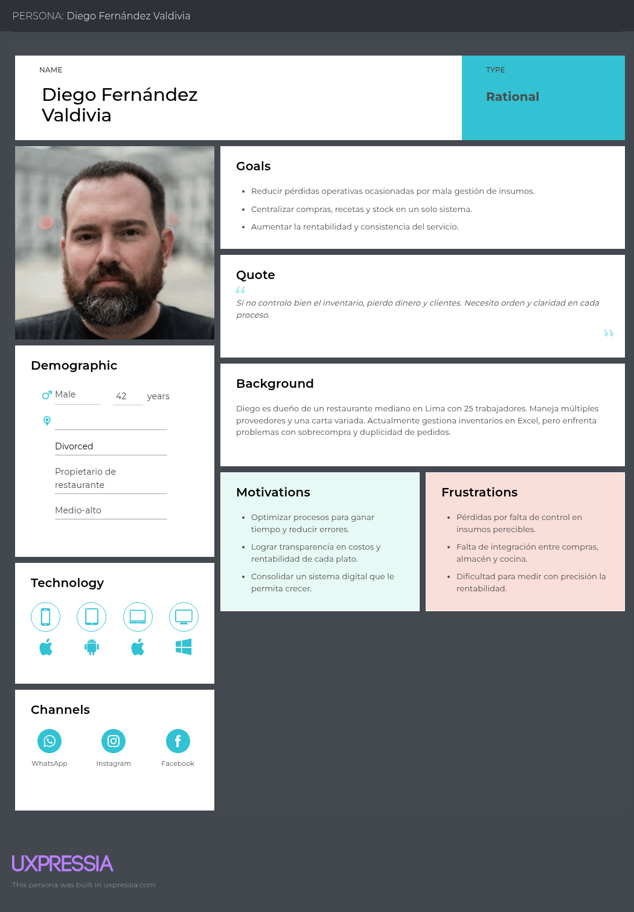
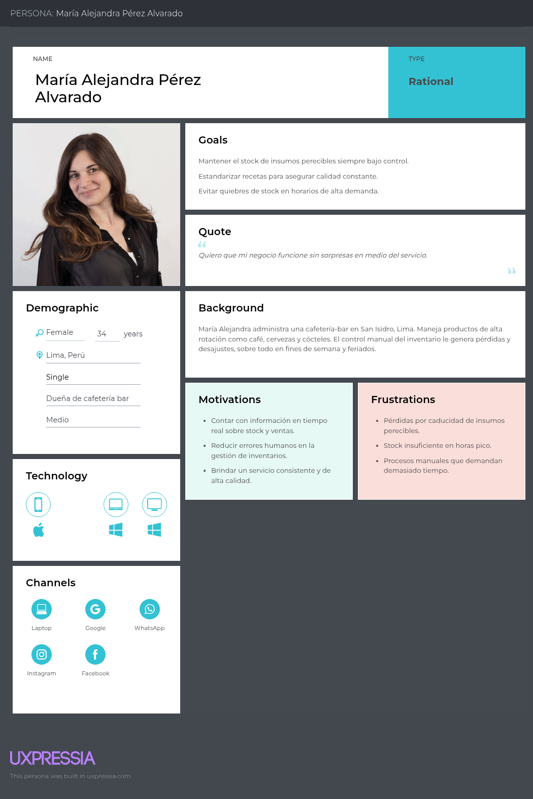
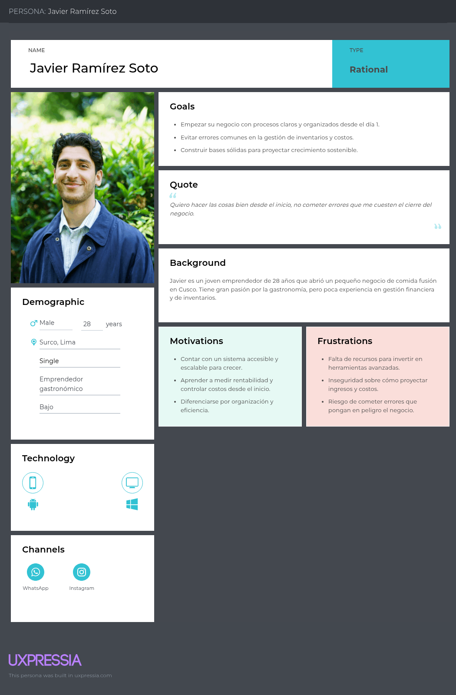
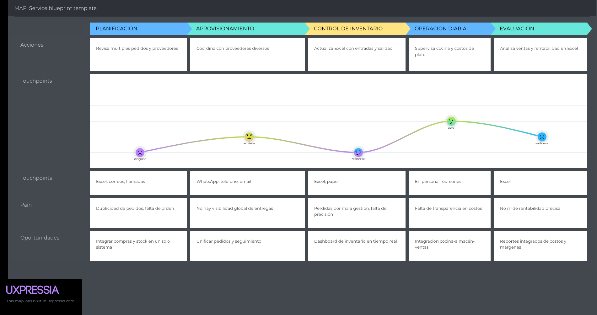
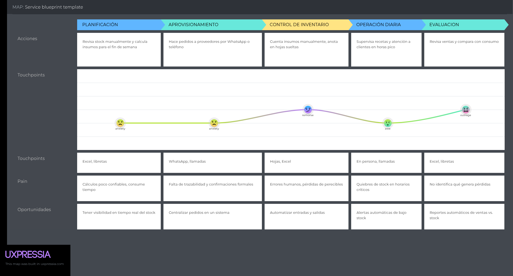
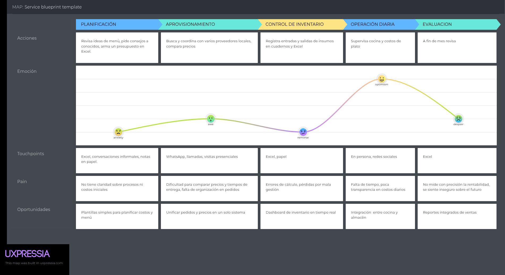
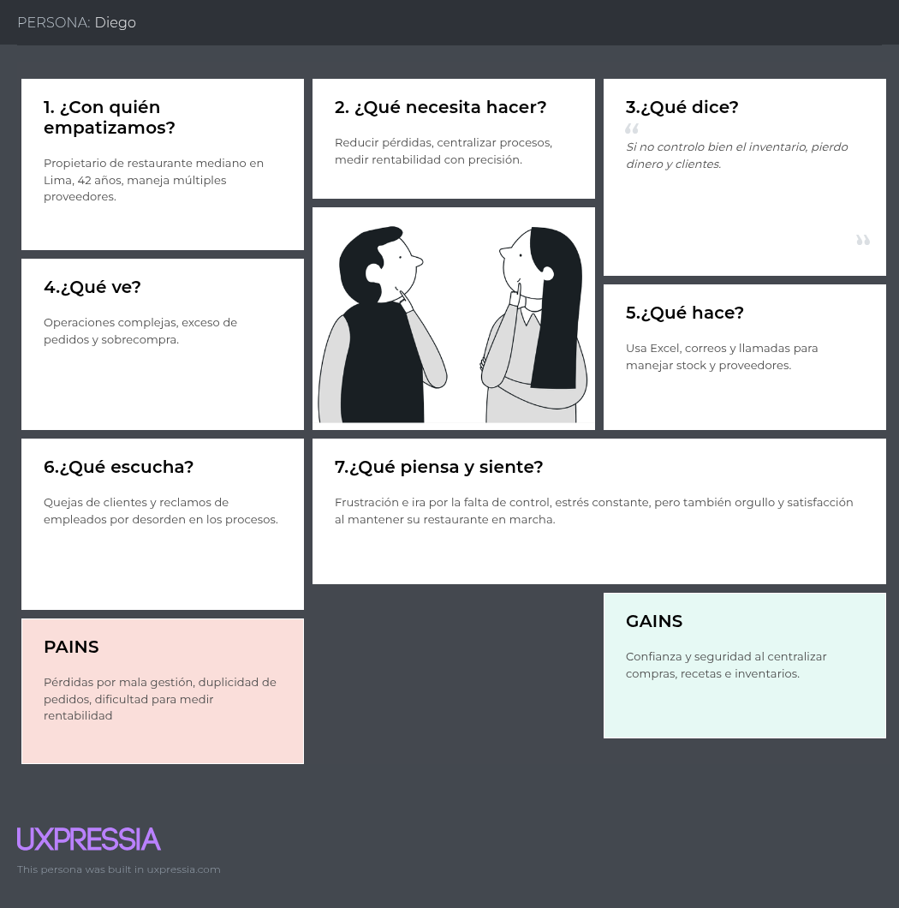
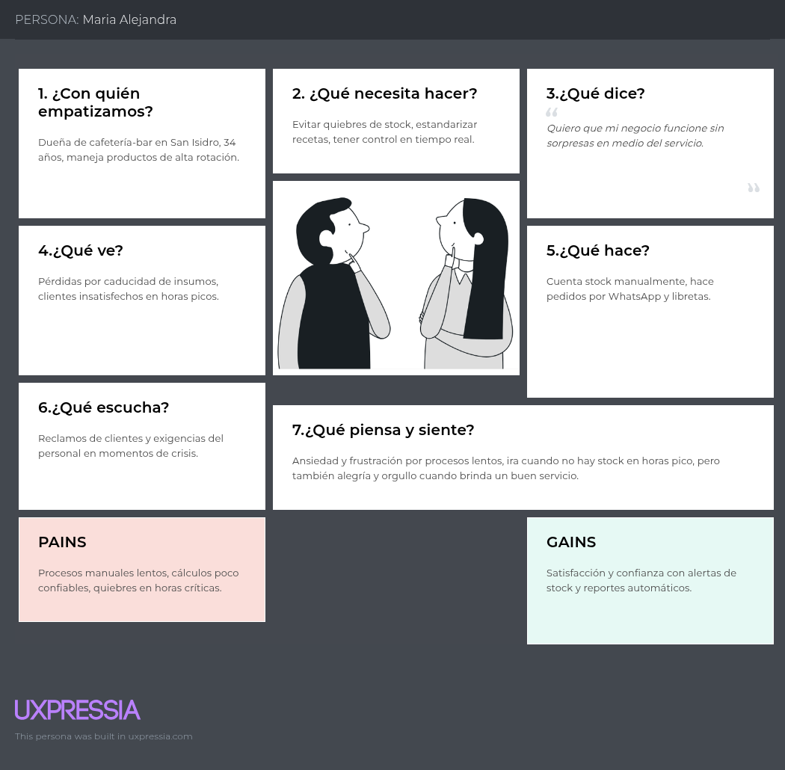
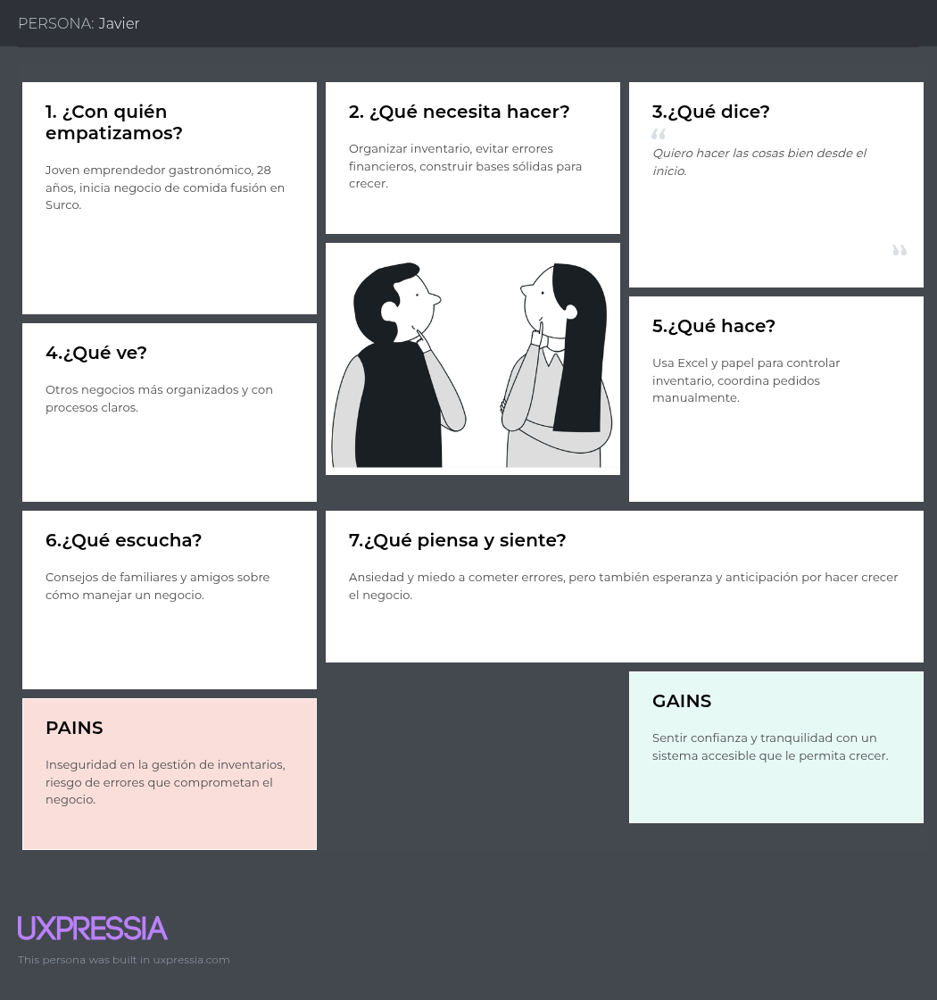
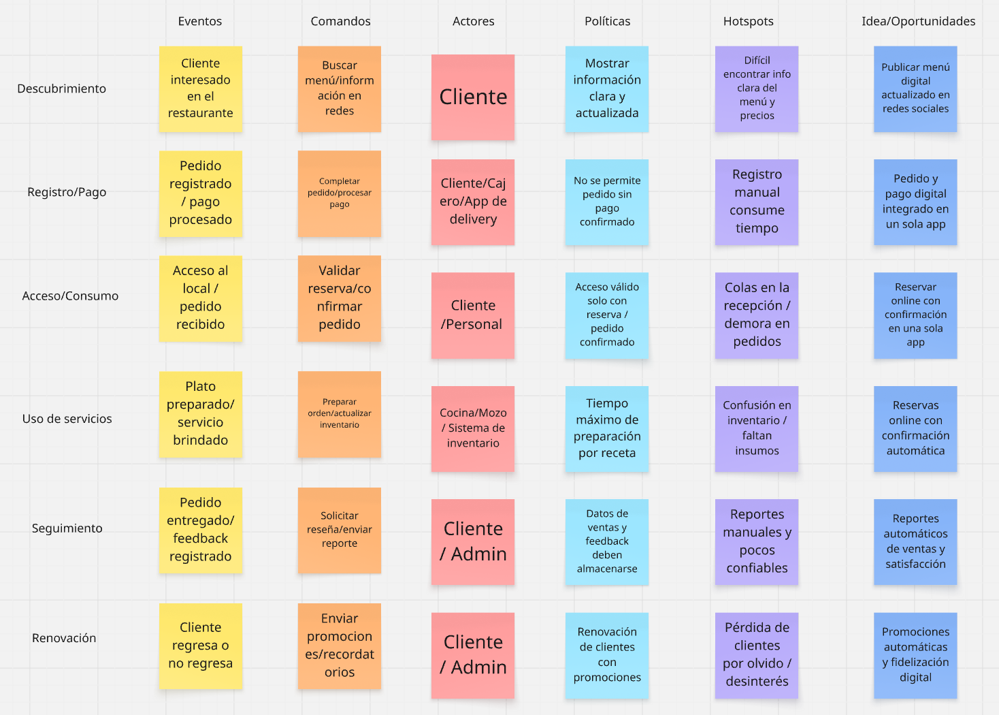

**Universidad Peruana de Ciencias Aplicadas**

**Carrera**: Ingeniería de Software

**Ciclo**: 2025-02

**Curso**: Aplicaciones Web

**Sección**: 7468

**Profesor**: Angel Augusto Velasquez Nuñez

**Informe de Trabajo Final**

**Startup**: CodeForce

**Producto**: LogisPE

**Integrantes**:

- Rodrigo Fabrizio Aguilar Untiveros
- Alessandro Ramiro Condori Lozano
- Mathias Javier Murillo
- Katherine Maryory Mejia
- Aliaga Augusto
- Sebastian Montes Maza

**Agosto del 2025**

---

# Registro de Versiones del Informe

<table>
    <tr>
        <th colspan="3">Version</th>
        <th colspan="3">Fecha</th>
        <th colspan="10">Autores</th>
        <th colspan="5">Descripción de Modificaciones</th>
    <tr>
        <td colspan="3">TB1</td>
        <td colspan="3">12/09/2025</td>
        <td colspan="10">Desarrollado por el equipo de LogisPe</td>
        <td colspan="5">Desarrollo de los capitulos 1 al 5</td>
    </tr>
</table>

---

# Project Report Collaboration Insights

A continuación, se detalla el proceso de elaboración del informe para cada entrega, junto con capturas de pantalla que muestran los análisis de colaboración y commits en GitHub para el repositorio del informe:

**URL del Repositorio del Informe:** https://github.com/Aplicaciones-Web-CodeForge/Report

**Entrega N°1: TB1**
 

Se han completado las tareas asignadas para la entrega TB1 en el repositorio de Github de la organización del equipo, accesible mediante el enlace: https://github.com/Aplicaciones-Web-CodeForge/Report

Para la creación del informe, se realizaron las siguientes actividades:

Cada miembro del equipo redactó y generó gráficos en formato Markdown según los puntos asignados, y luego se hicieron commits para registrar el progreso en el repositorio.

Se crearon los artefactos necesarios usando las herramientas recomendadas, y se obtuvieron los enlaces de las imágenes correspondientes a través de la funcionalidad de "Issues" en el repositorio del informe.

Se llevaron a cabo reuniones periódicas para coordinar el avance de los puntos del informe. Estas reuniones también se utilizaron para comunicar el progreso alcanzado durante el Sprint 1, enfocado en el desarrollo de la Landing Page del proyecto.

---

# Student Outcome

Objetivo general, ABET – EAC - Student Outcome 3: Capacidad de comunicarse efectivamente con un rango de audiencias.

# Outcomes TB1 – Pilares del Producto y Landing Page  

| **Criterio específico** | **Acciones realizadas** | **Conclusiones** |
|-------------------------|--------------------------|------------------|
| **Comunica oralmente con efectividad a diferentes rangos de audiencia.** | **Rodrigo Fabrizio Aguilar Untiveros** **TB1**: Participé activamente en reuniones grupales mediante llamadas y coordinación por mensajería, lo que permitió exponer los pilares del producto de manera clara y coordinar los avances de la landing page.  **Alessandro Ramiro Condori Lozano** **TB1**: Aporté en la organización de ideas y la explicación de los mensajes principales, lo que ayudó al equipo a mantener un discurso claro sobre los objetivos del producto y su representación en la landing page.  **Mathias Javier Murillo** **TB1**: Colaboré en la comunicación de los contenidos de la landing page, explicando la forma en que los pilares del producto se mostrarían para distintos públicos, lo que ayudó a alinear el enfoque del equipo.  **Katherine Maryory Mejia Aliaga** **TB1**: Expuse ideas relacionadas a la organización visual y conceptual, facilitando que la comunicación oral del equipo se tradujera en una landing page coherente y entendible.  **Augusto Sebastian Montes Maza** **TB1**: Participé en la comunicación y discusión grupal para asegurar que los pilares del producto estuvieran alineados con la propuesta, contribuyendo a un discurso claro y consensuado. | **Rodrigo Fabrizio Aguilar Untiveros** **TB1**: La comunicación oral constante permitió coordinar tareas de forma eficiente y transmitir con claridad los pilares del producto.  **Alessandro Ramiro Condori Lozano** **TB1**: La exposición clara de ideas contribuyó a que el equipo lograra alinear mensajes y objetivos en la landing page.  **Mathias Javier Murillo** **TB1**: La comunicación clara facilitó la comprensión de los contenidos y mejoró la coherencia de la propuesta en la landing page.  **Katherine Maryory Mejia Aliaga** **TB1**: La intervención oral favoreció el orden en la estructura del proyecto y reforzó la efectividad del mensaje hacia la audiencia.  **Augusto Sebastian Montes Maza** **TB1**: La comunicación oral ayudó a mantener la coherencia entre los pilares del producto y el mensaje general del proyecto. |
| **Comunica por escrito con efectividad a diferentes rangos de audiencia.** | **Rodrigo Fabrizio Aguilar Untiveros** **TB1**: Contribuí en la redacción de la propuesta de valor y en la descripción de los pilares del producto, asegurando un lenguaje claro y entendible en la landing page.  **Alessandro Ramiro Condori Lozano** **TB1**: Aporté en la redacción de los mensajes principales del proyecto, mejorando la claridad escrita de la propuesta en el documento y la landing page.  **Mathias Javier Murillo** **TB1**: Participé en la redacción y ajuste de los contenidos escritos para que fueran comprensibles para diferentes públicos, adaptando el mensaje de los pilares del producto.  **Katherine Maryory Mejia Aliaga** **TB1**: Apoyé en la organización escrita de las ideas del equipo, contribuyendo a que la landing page reflejara los pilares de forma clara y ordenada.  **Augusto Sebastian Montes Maza** **TB1**: Colaboré en la redacción de los contenidos de la propuesta, asegurando coherencia y alineación en los textos del proyecto. | **Rodrigo Fabrizio Aguilar Untiveros** **TB1**: La comunicación escrita permitió expresar los pilares del producto de forma clara y accesible para la audiencia.  **Alessandro Ramiro Condori Lozano** **TB1**: La claridad en los textos fortaleció la efectividad del mensaje del proyecto y su comprensión en la landing page.  **Mathias Javier Murillo** **TB1**: La participación en la redacción aseguró que los pilares del producto fueran transmitidos de manera simple y atractiva.  **Katherine Maryory Mejia Aliaga** **TB1**: La organización de las ideas escritas facilitó que la landing page comunicara con claridad los objetivos del proyecto.  **Augusto Sebastian Montes Maza** **TB1**: La coherencia en los contenidos escritos permitió mantener un mensaje uniforme y alineado con la propuesta del producto. |

---

# Contenido

## Tabla de contenidos

### [Capítulo I: Introducción](#capítulo-i-introducción)

- [1.1. Startup Profile](#11-startup-profile)
  - [1.1.1 Descripción de la Startup](#111-descripción-de-la-startup)
  - [1.1.2 Perfiles de integrantes del equipo](#112-perfiles-de-integrantes-del-equipo)
- [1.2 Solution Profile](#12-solution-profile)
  - [1.2.1 Antecedentes y problemática](#121-antecedentes-y-problemática)
  - [1.2.2 Lean UX Process](#122-lean-ux-process)
    - [1.2.2.1. Lean UX Problem Statements](#1221-lean-ux-problem-statements)
    - [1.2.2.2. Lean UX Assumptions](#1222-lean-ux-assumptions)
    - [1.2.2.3. Lean UX Hypothesis Statements](#1223-lean-ux-hypothesis-statements)
    - [1.2.2.4. Lean UX Canvas](#1224-lean-ux-canvas)
- [1.3. Segmentos objetivo](#13-segmentos-objetivo)

### [Capítulo II: Requirements Elicitation & Analysis](#capítulo-ii-requirements-elicitation--analysis)

- [2.1. Competidores](#21-competidores)
  - [2.1.1. Análisis competitivo](#211-análisis-competitivo)
  - [2.1.2. Estrategias y tácticas frente a competidores](#212-estrategias-y-tácticas-frente-a-competidores)
- [2.2. Entrevistas](#22-entrevistas)
  - [2.2.1. Diseño de entrevistas](#211-análisis-competitivo)
  - [2.2.2. Registro de entrevistas](#222-registro-de-entrevistas)
  - [2.2.3. Análisis de entrevistas](#223-análisis-de-entrevistas)
- [2.3. Needfinding](#23-needfinding)
  - [2.3.1. User Personas](#231-user-personas)
  - [2.3.2. User Task Matrix](#232-user-task-matrix)
  - [2.3.3. User Journey Mapping](#233-user-journey-mapping)
  - [2.3.4. Empathy Mapping](#234-empathy-mapping)
- [2.4. Big Picture Event Storming](#24-big-picture-event-storming)
- [2.5. Ubiquitous Language](#25-ubiquitous-language)

### [Capítulo III: Requirements Specification](#capítulo-iii-requirements-specification)

- [3.1. User Stories](#31-user-stories)
- [3.2. Impact Mapping](#32-impact-mapping)
- [3.3. Product Backlog](#33-product-backlog)

### [Capítulo IV: Product Design](#capítulo-iv-product-design)

- [4.1. Style Guidelines](#41-style-guidelines)
  - [4.1.1. General Style Guidelines](#411-general-style-guidelines)
  - [4.1.2. Web Style Guidelines](#412-web-style-guidelines)
- [4.2. Information Architecture](#42-information-architecture)
  - [4.2.1. Organization Systems](#421-organization-systems)
  - [4.2.2. Labeling Systems](#422-labeling-systems)
  - [4.2.3. SEO Tags and Meta Tags](#423-seo-tags-and-meta-tags)
  - [4.2.4. Searching Systems](#424-searching-systems)
  - [4.2.5. Navigation Systems](#425-navigation-systems)
- [4.3. Landing Page UI Design](#43-landing-page-ui-design)
  - [4.3.1. Landing Page Wireframe](#431-landing-page-wireframe)
  - [4.3.2. Landing Page Mock-up](#432-landing-page-mock-up)
- [4.4. Web Applications UX/UI Design](#44-web-applications-uxui-design)
  - [4.4.1. Web Applications Wireframes](#441-web-applications-wireframes)
  - [4.4.2. Web Applications Wireflow Diagrams](#442-web-applications-wireflow-diagrams)
  - [4.4.3. Web Applications Mock-ups](#443-web-applications-mock-ups)
  - [4.4.4. Web Applications User Flow Diagrams](#444-web-applications-user-flow-diagrams)
- [4.5. Web Applications Prototyping](#45-web-applications-prototyping)
- [4.6. Domain-Driven Software Architecture](#46-domain-driven-software-architecture)
  - [4.6.1. Design-Level Event Storming](#461-design-level-event-storming)
  - [4.6.2. Software Architecture Context Diagram](#462-software-architecture-context-diagram)
  - [4.6.3. Software Architecture Container Diagrams](#463-software-architecture-container-diagrams)
  - [4.6.4. Software Architecture Components Diagrams](#464-software-architecture-components-diagrams)
- [4.7. Software Object-Oriented Design](#47-software-object-oriented-design)
  - [4.7.1. Class Diagrams](#471-class-diagrams)
- [4.8. Database Design](#48-database-design)
  - [4.8.1. Database Diagram](#481-database-diagram)

### [Capítulo V: Product Implementation, Validation & Deployment](#capítulo-v-product-implementation-validation--deployment)

- [5.1. Software Configuration Management](#51-software-configuration-management)
  - [5.1.1. Software Development Environment Configuration](#511-software-development-environment-configuration)
  - [5.1.2. Source Code Management](#512-source-code-management)
  - [5.1.3. Source Code Style Guide & Conventions](#513-source-code-style-guide--conventions)
  - [5.1.4. Software Deployment Configuration](#514-software-deployment-configuration)
- [5.2. Landing Page, Services & Applications Implementation](#52-landing-page-services--applications-implementation)
  - [5.2.1. Sprint 1](#521-sprint-1)
    - [5.2.1.1. Sprint Planning 1](#5211-sprint-planning-1)
    - [5.2.1.2. Sprint Backlog 1](#5212-aspect-leaders-and-collaborators)
    - [5.2.1.3. Development Evidence for Sprint Review](#5213-sprint-backlog-1)
    - [5.2.1.4. Testing Suite Evidence for Sprint Review](#5214-development-evidence-for-sprint-review)
    - [5.2.1.5. Execution Evidence for Sprint Review](#5215-execution-evidence-for-sprint-review)
    - [5.2.1.6. Services Documentation Evidence for Sprint Review](#5216-services-documentation-evidence-for-sprint-review)
    - [5.2.1.7. Software Deployment Evidence for Sprint Review](#5217-software-deployment-evidence-for-sprint-review)
    - [5.2.1.8. Team Collaboration Insights during Sprint](#5218-team-collaboration-insights-during-sprint)
- [5.3. Validation Interviews](#53-validation-interviews)
  - [5.3.1. Diseño de Entrevistas](#531-diseño-de-entrevistas)
  - [5.3.2. Registro de Entrevistas](#532-registro-de-entrevistas)
  - [5.3.3. Evaluaciones según heurísticas](#533-evaluaciones-según-heurísticas)
- [5.4. Video About-the-Product](#54-video-about-the-product)

### [Conclusiones](#conclusiones)

#### [Conclusiones y recomendaciones](#conclusiones-y-recomendaciones)

#### [Video About-the-Team](#video-about-the-team)

### [Biblioteca](#biblioteca)

### [Anexos](#anexos)

---

# Capítulo I: Introducción

## 1.1. Startup Profile

### 1.1.1 Descripción de la Startup

En un entorno económico cada vez más competitivo, donde la eficiencia operativa se ha convertido en un factor determinante para la supervivencia y el crecimiento de las empresas, surge la necesidad de soluciones tecnológicas que optimicen procesos y reduzcan costos. Nuestra startup se presenta como respuesta a esta demanda, ofreciendo una aplicación web de gestión de inventarios específicamente diseñada para pequeñas y medianas empresas del sector gastronómico, con un enfoque inicial en restobares y restaurantes, sectores caracterizados por un alto dinamismo y un consumo intensivo de insumos perecibles.

La solución tecnológica propuesta tiene como objetivo principal facilitar el control en tiempo real del stock de productos e insumos. El sistema permitirá a los administradores y propietarios gestionar con mayor precisión las compras, identificar tendencias de consumo, minimizar pérdidas por caducidad o deterioro, y recibir alertas automáticas cuando los niveles de inventario estén próximos a agotarse. Esta capacidad de supervisión inmediata resulta crucial en un negocio donde las decisiones deben tomarse con rapidez para evitar sobrecostos o interrupciones en el servicio.

A diferencia de sistemas tradicionales o de registros manuales, nuestra plataforma ofrece accesibilidad desde cualquier dispositivo con conexión a internet, lo cual garantiza disponibilidad en todo momento y lugar. Asimismo, se integra con mecanismos de seguridad y gestión de roles que aseguran el uso confiable de la herramienta y la protección de los datos. Estas características no solo fortalecen la transparencia y la trazabilidad de la información, sino que también promueven la confianza en la toma de decisiones.

La propuesta de valor radica en la simplicidad y personalización del sistema. Mientras que soluciones corporativas suelen ser costosas y complejas de implementar, nuestra startup busca ofrecer una herramienta intuitiva, adaptable a las particularidades de cada negocio y asequible para el mercado objetivo. Con ello, no solo se pretende optimizar los procesos internos, sino también contribuir a la sostenibilidad y crecimiento de los negocios gastronómicos, donde los márgenes de rentabilidad suelen ser reducidos.

**Misión**: Brindar a pequeñas y medianas empresas un sistema de gestión de inventario eficiente, accesible y seguro que optimice el control de productos, insumos y proveedores, facilitando la toma de decisiones en tiempo real.

**Visión**: Convertirse en la aplicación de referencia para la gestión de inventarios en el sector gastronómico y de servicios, reconocida por su confiabilidad, usabilidad y capacidad de adaptación a las necesidades del cliente.

### 1.1.2 Perfiles de integrantes del equipo

| Integrantes | Descripción | Conocimientos |
| :---------- | :---------- | :------------ |
| 
&nbsp;&nbsp; **Mathias Javier Murillo**
 | Estudiante de Ingeniería de Software. Apasionado por las nuevas tecnologías y realizar nuevos proyectos | Conocimientos en SQL, HTML, JS, CSS y Python |
| 
&nbsp;&nbsp; **Alessandro Condori**
 | Soy estudiante de la carrera de Ingeniería de Software, puedo aportar mucho al equipo, aplicando mis conocimientos en diversos lenguajes de programación | Java, C++, Python, html, css, javascrip, C# y SQL |
| 
&nbsp;&nbsp; **Augusto Montes**
 | Estudiante de la carrera de Ingeniería de Software. Programador amateur, interesado en la creación de aplicaciones, ciberseguridad y videojuegos| C++, C#, SQL, Html, css, javascript, python y java |
| 
&nbsp;&nbsp; **Katherine Mejia**
 | Estudiante de 5to ciclo de la carrera de ingeniería de software. Tengo experiencia creando aplicaciones front end que consuman una API y hagan peticiones. | C++, C#, SQL, Html, css, javascript, python y java |
| 
&nbsp;&nbsp; **Rodrigo Aguilar**
 | Estudiante de Ingeniería de Software cursando el 6 ciclo de la carrera de ingeniería de software.  | Tengo experiencia con Javascript, Java, C++. |

## 1.2 Solution Profile

La presente sección, Solution Profile, tiene como finalidad exponer un marco integral que permita comprender la naturaleza del problema identificado, sus impactos en el sector gastronómico y la propuesta de solución que nuestra startup ofrece. A través de un análisis estructurado, basado en la técnica de los 5W’s & 2H’s, se abordarán los antecedentes y la problemática central que enfrentan restaurantes y restobares en la gestión de inventarios.

El análisis se fundamenta en evidencias empíricas y académicas que confirman que la carencia de herramientas de control adecuadas puede representar pérdidas significativas, no solo en términos financieros, sino también en la experiencia del cliente, en la sostenibilidad del negocio y en la capacidad de crecimiento.

Al situar el problema en un contexto más amplio, se busca justificar la pertinencia de la solución propuesta y establecer las bases para la implementación de un sistema que no solo atienda a necesidades inmediatas, sino que también se proyecte como una herramienta estratégica de largo plazo.

### 1.2.1 Antecedentes y problemática

Para comprender en profundidad los desafíos que enfrenta el sector gastronómico en relación con el control de inventarios, se aplicó la técnica 5W’s & 2H’s, la cual permite organizar el análisis de manera sistemática:

**What**:

Restaurantes y restobares experimentan pérdidas económicas recurrentes debido a la ausencia de un control eficiente en el uso de insumos y gestión de inventarios. Estas pérdidas suelen manifestarse en forma de desperdicios, caducidad de productos, compras excesivas o faltantes que interrumpen la operación.

**When**:

Esta problemática se observa actualmente con mayor frecuencia, dado que el mercado gastronómico exige altos niveles de eficiencia para responder a un entorno competitivo en el cual los consumidores demandan calidad, precios justos y continuidad en el servicio.

**Where**:

El problema es común en múltiples geografías, pero cobra especial relevancia en el Perú, país reconocido por su diversidad gastronómica y la proliferación de negocios dedicados a la restauración. Dentro de este marco, se enfatiza el caso del restobar Bolivarcito, ubicado en Lima, como ejemplo representativo.

**Who**:

Los principales afectados son los propietarios, administradores y trabajadores de restaurantes, quienes dependen de información precisa para tomar decisiones relacionadas con compras, ventas, producción y control de stock.

**Why**:

El uso de métodos manuales o herramientas no especializadas genera errores frecuentes, tales como duplicación de registros, pérdida de datos o retrasos en la disponibilidad de información, lo que repercute negativamente en la productividad.

**How**:

La solución radica en implementar un sistema web centralizado que permita gestionar inventarios en tiempo real, integrar a proveedores y recetas, y emitir alertas automáticas para anticiparse a faltantes o excesos.

**How much**:

Los costos de un sistema ineficiente son altos. Estudios en el sector señalan que las pérdidas por mala gestión de inventario pueden alcanzar entre el 10 % y 15 % de los ingresos, lo que impacta directamente en la rentabilidad (Universidad Le Cordon Bleu, 2022).

_Estadística de la problemática_

. En Perú, según la Universidad Le Cordon Bleu, los llamados “costos ocultos” como mermas no contabilizadas, obsolescencia, errores en almacenamiento o traslado pueden equivaler al 10 % o 15 % de pérdida en restaurantes, afectando significativamente la productividad y rentabilidad (Diario la Republica, 2022).

. Un estudio en empresas restauranteras públicas en EE.UU. entre 1999 y 2015 concluye que una alta rotación de inventario se asocia positivamente con la rentabilidad. Esto muestra la relevancia de un control eficiente, sobre todo cuando los costos de insumos representan más de un tercio de los ingresos totales (Sage Journals, 2020).

### 1.2.2 Lean UX Process

El proceso Lean UX constituye un enfoque esencial para startups tecnológicas, ya que busca validar hipótesis de negocio de manera ágil, reduciendo riesgos y maximizando el aprendizaje temprano con clientes reales. A diferencia de los modelos tradicionales de desarrollo, que suelen invertir grandes cantidades de tiempo y recursos antes de probar la utilidad del producto, Lean UX prioriza la experimentación, la retroalimentación continua y la iteración rápida. En el contexto de nuestra propuesta de valor, este proceso permitirá comprender mejor las necesidades de los negocios gastronómicos y diseñar una solución ajustada a sus expectativas reales, garantizando un producto con mayor aceptación en el mercado.

#### 1.2.2.1. Lean UX Problem Statements

Los Problem Statements se formulan para definir con claridad los principales retos que enfrentan nuestros usuarios. Estos no son simples enunciados, sino representaciones estratégicas de las brechas actuales en la gestión de inventarios. La ausencia de visibilidad en tiempo real del stock genera escenarios críticos: desde pérdidas económicas por insumos caducados hasta sobrecompras que inmovilizan capital. Esto limita la capacidad de reacción de los negocios frente a la demanda y debilita su competitividad.

Del mismo modo, la gestión manual de insumos y recetas se traduce en procesos lentos, repetitivos y propensos a errores humanos. Estos fallos repercuten directamente en la experiencia del cliente final, ya que los restobares o cafés pueden ofrecer un servicio inconsistente o incluso enfrentar quiebres de stock en momentos de alta demanda. En este contexto, resulta evidente que el problema no solo afecta a la rentabilidad, sino también a la reputación del negocio.

**Problem Statement 1:**

Los propietarios y administradores de restaurantes, cafés y restobares enfrentan serias dificultades para tener visibilidad en tiempo real del inventario. En la mayoría de los casos, dependen de registros manuales, hojas de cálculo desactualizadas o simples estimaciones, lo que impide contar con información precisa y confiable. Esta carencia conlleva consecuencias críticas: por un lado, se producen quiebres de inventario en momentos de alta demanda, generando pérdida de ventas, insatisfacción en los clientes y daño en la reputación del negocio. Por otro lado, también se generan excesos de compras y acumulación innecesaria de productos, que muchas veces terminan en desperdicio o caducidad, incrementando los costos operativos. En un sector altamente competitivo como el gastronómico, la falta de control oportuno del stock no solo afecta la eficiencia de las operaciones, sino que compromete la sostenibilidad financiera del negocio a mediano y largo plazo.

**Problem Statement 2:**

La gestión manual de insumos, recetas y procesos relacionados al control de inventario consume grandes cantidades de tiempo y se convierte en una fuente recurrente de errores humanos. El uso de métodos tradicionales, como anotaciones en cuadernos o la dependencia exclusiva de la memoria del personal, genera inconsistencias en las cantidades registradas, omisiones en los cálculos de costos y dificultades para rastrear el uso de cada insumo en las preparaciones. Estas fallas impactan directamente en la rentabilidad del negocio, ya que dificultan la correcta proyección de compras y provocan mermas innecesarias. Además, la ausencia de un sistema estandarizado limita la capacidad de replicar procesos de manera consistente, afectando la calidad del servicio ofrecido al cliente final. En consecuencia, la gestión manual no solo compromete la eficiencia interna, sino también la experiencia del consumidor, reduciendo la competitividad del negocio frente a aquellos que han adoptado soluciones digitales.

#### 1.2.2.2. Lean UX Assumptions

En esta sección se establecen las suposiciones de negocio y de usuario que guiarán el desarrollo de la solución propuesta. Dichas suposiciones constituyen hipótesis que deberán ser validadas en el proceso de diseño y puesta en marcha del sistema, a fin de reducir riesgos y garantizar que la aplicación responda efectivamente a las necesidades del mercado. Siguiendo el marco de Lean UX, estas hipótesis se convierten en una guía para orientar decisiones de diseño, priorización de funcionalidades y estrategias de adquisición de clientes. Las siguientes suposiciones se formulan considerando las particularidades del sector gastronómico, las tendencias de digitalización y los principales desafíos en la gestión de inventarios.

**Business Outcomes:**

- **Creemos que mis usuarios necesitan**

Un sistema ágil, intuitivo y confiable que les permita controlar de manera integral los inventarios, gestionar proveedores de forma más eficiente y anticipar posibles quiebres de stock.

- **Estas necesidades se pueden resolver**

Mediante un software web multiplataforma, accesible desde cualquier dispositivo con conexión a internet, que brinde visibilidad en tiempo real, alarmas preventivas y herramientas de análisis para la toma de decisiones estratégicas.

- **Nuestros clientes iniciales son**

Negocios gastronómicos de pequeña y mediana escala, como restobares, cafeterías y restaurantes, que requieren optimizar la administración de sus insumos sin necesidad de contar con un gran equipo administrativo o con elevados presupuestos tecnológicos.

- **El valor #1 que un cliente requiere de nuestro servicio es**

La precisión y confiabilidad en la gestión del inventario, garantizando el abastecimiento oportuno de insumos y reduciendo las pérdidas ocasionadas por desperdicios, caducidad o compras excesivas.

- **El cliente también puede obtener estos beneficios adicionales**

Generación de reportes detallados y personalizables, reducción de pérdidas económicas, incremento en la eficiencia operativa, mejor control de costos, mayor trazabilidad de los insumos y, en consecuencia, un aumento en la rentabilidad del negocio.

- **Adquiriremos a nuestros clientes a través del**

Estrategias de marketing digital, colaboraciones con asociaciones gastronómicas, recomendaciones entre colegas del sector, y la implementación de planes de prueba gratuita que permitan experimentar los beneficios antes de la adquisición.

- **Haremos dinero a través de**

Un modelo de suscripción mensual o anual, complementado con la venta de licencias y el cobro por servicios de soporte técnico, mantenimiento y actualizaciones continuas del sistema.

- **Nuestra competencia de mercado serán**

Sistemas de inventario genéricos o de uso general, que no se encuentran especializados en el sector gastronómico y, por lo tanto, no logran resolver de manera completa las necesidades particulares de este mercado.

- **Los venceremos debido a que**

Ofrecemos una solución diseñada específicamente para la industria gastronómica, con funcionalidades adaptadas a sus procesos únicos, interfaces fáciles de usar y un enfoque en la reducción de pérdidas y mejora de la rentabilidad.

- **Nuestros mayores riesgos son**

La resistencia de algunos negocios a adoptar nuevas tecnologías, la percepción de que los sistemas digitales son costosos, así como la falta de conocimiento técnico para utilizarlos de manera efectiva.

- **Resolveremos esto mediante**

Programas de capacitación prácticos, soporte técnico cercano y proactivo, y el diseño de un sistema intuitivo que reduzca la curva de aprendizaje y genere confianza en su implementación.

- **Sabremos que hemos tenido éxito cuando uno de estos cambios en el comportamiento de nuestro cliente**

El uso constante y disciplinado del sistema en las operaciones diarias, la reducción medible de pérdidas en insumos, la mejora en el control financiero y un mayor grado de satisfacción en la gestión del negocio.

- **Qué otras suposiciones tenemos que, de probarse falsas pueden causar que nuestro proyecto fracase**

Que los negocios gastronómicos no consideren prioritario invertir en tecnología de gestión, que prefieran continuar con métodos tradicionales manuales, o que la percepción del costo-beneficio no sea suficiente para justificar la adopción del sistema.

**User Outcomes**

**¿Quiénes serán nuestros usuarios?**

Nuestros usuarios principales serán propietarios, administradores y personal operativo de restaurantes, cafeterías, restobares y bares. Estos perfiles desempeñan un papel clave en la gestión de compras, control de insumos y organización del servicio diario.

**¿Dónde encaja nuestro producto en su vida o trabajo?**

El producto se integra de manera directa en la gestión diaria del negocio gastronómico, apoyando actividades como:

- Control de inventarios.
- Registro de compras y ventas.
- Organización de recetas e insumos.
- Coordinación con proveedores y gestión de pedidos.

**¿Qué problemas tiene nuestro producto y cómo se pueden resolver?**

**Problemas:**

- Sobrecostos ocasionados por desorganización y compras innecesarias.
- Falta de control en el stock de insumos.
- Retrasos en pedidos y reposiciones críticas.
- Pérdidas económicas por caducidad, desperdicio o errores de registro.

**Soluciones:**

- Automatización de inventarios con reportes y alertas inteligentes.
- Acceso a un sistema web centralizado y disponible desde cualquier dispositivo.
- Notificaciones automáticas sobre niveles bajos de stock.
- Módulo de gestión de recetas y proveedores que optimiza la planificación de compras.

**¿Cómo y cuándo es usado nuestro producto?**

El sistema será utilizado todos los días, en las diferentes fases de operación de un negocio gastronómico:

- Apertura: revisión de stock, planificación de compras y pedidos.
- Operación diaria: registro de insumos utilizados, actualización de recetas y control de ventas.
- Cierre: consolidación de reportes, cálculo de costos y análisis de pérdidas o desperdicios.

**¿Qué características son importantes?**

- Gestión integral de stock e insumos.
- Automatización de alertas para evitar quiebres de inventario.
- Reportes detallados de costos, consumo y eficiencia.
- Gestión de proveedores y recetas vinculadas a inventario.
- Roles y permisos de usuarios que garanticen control y trazabilidad.
- Exportación de reportes en formatos PDF/Excel para facilitar la toma de decisiones.

**¿Cómo debe verse y comportarse nuestro producto?**

Debe ser un sistema intuitivo, moderno y fácil de usar, con una interfaz limpia que priorice la claridad visual. Además, debe ser rápido, seguro y confiable, con un diseño adaptable a cualquier dispositivo (desktop, tablet, smartphone) para acompañar a los usuarios en todo momento de su operación diaria.

**Features**

- Gestión de stock en tiempo real.
- Alertas automáticas de inventario bajo.
- Creación y administración de recetas.
- Gestión de proveedores y pedidos.
- Roles y permisos de usuarios.
- Generación de reportes personalizables (PDF/Excel).

**_Desde la cuenta de la empresa cliente:_**

- Las empresas deben tener acceso a un panel donde visualicen todos los equipos arrendados, organizados por área o departamento. Esto les permitirá un control ordenado y evitar pérdidas o duplicidades.

- Además, se debería incluir un sistema de búsqueda avanzada y filtros dinámicos (por tipo de dispositivo, fecha de adquisición, estado de garantía, proveedor asignado), lo que mejorará la eficiencia en la gestión.

- Un historial de mantenimiento y soporte estará disponible para cada equipo, lo que garantiza transparencia en las intervenciones técnicas y ayuda a tomar decisiones futuras. Dicho historial podría exportarse en formatos PDF/Excel y compartirse con auditores o gerentes para cumplir con normativas internas o legales.

- Contarán con un sistema de alertas automáticas para notificar cuándo un equipo está próximo a su renovación o si requiere atención especial, evitando interrupciones en su productividad. Estas alertas podrían configurarse con niveles de criticidad (baja, media, alta), y enviarse no solo dentro de la plataforma, sino también mediante correo electrónico o aplicaciones de mensajería (ej. WhatsApp Business o Microsoft Teams).

- El cliente podrá solicitar upgrades de hardware de forma ágil desde su cuenta, ajustando los recursos a sus necesidades reales en tiempo casi inmediato. Esto debería estar integrado con un catálogo dinámico de opciones disponibles, donde el cliente pueda comparar costos, beneficios y tiempos de entrega.

- Un dashboard de costos consolidado permitirá analizar el gasto mensual en TI y medir el ahorro frente a un modelo tradicional de compra. Este dashboard debería incluir gráficas comparativas, simuladores de costos futuros y métricas de ROI (Retorno de Inversión) para respaldar la toma de decisiones estratégicas.

- Adicionalmente, la cuenta cliente podría integrar un módulo de tickets de soporte, donde se pueda dar seguimiento en tiempo real al estado de cada solicitud, con tiempos de respuesta garantizados (SLA).

- Finalmente, un módulo de capacitación digital permitiría que los usuarios accedan a tutoriales, manuales y webinars dentro del mismo sistema, facilitando la adopción tecnológica.

**_Desde la cuenta de administración de PcPedia:_**

- Los administradores tendrán un sistema centralizado para monitorear en tiempo real todos los equipos en uso por los clientes, junto con su estado de garantía y mantenimientos programados. Esto debe incluir un mapa interactivo de clientes (geolocalización) para optimizar la distribución de técnicos y recursos.

- Contarán con herramientas de análisis predictivo para recomendar a cada cliente los equipos más rentables según su patrón de uso. Este análisis podría alimentarse con modelos de machine learning, que identifiquen patrones de fallas, ciclos de vida óptimos y predicciones de sustitución.

- Se dispondrá de un módulo para gestionar contratos y facturación de manera automatizada, evitando errores manuales. Además, debería soportar múltiples métodos de pago (tarjeta, transferencia, pasarelas digitales como Stripe o PayPal) y la posibilidad de facturación electrónica integrada según normativas locales.

- La plataforma permitirá registrar casos de soporte y asignar técnicos rápidamente, reduciendo los tiempos de respuesta. Se puede integrar un sistema de priorización automática que clasifique los tickets por urgencia y complejidad, asignando el recurso más calificado de forma inmediata.

- Un repositorio de métricas de clientes servirá para identificar patrones, generar reportes y mejorar continuamente el servicio de Smart Leasing. Dicho repositorio debería estar acompañado de un sistema de benchmarking, que compare el desempeño de diferentes clientes y ofrezca insights personalizados para la optimización.

- PcPedia también podría contar con un módulo de administración de inventario interno, que permita verificar la disponibilidad de equipos, repuestos y accesorios antes de aprobar solicitudes de clientes.

- Finalmente, un sistema de auditoría y trazabilidad registrará todas las acciones realizadas por administradores y clientes, garantizando seguridad, transparencia y cumplimiento normativo (por ejemplo, GDPR o regulaciones locales de protección de datos).

#### 1.2.2.3. Lean UX Hypothesis Statements

- **Creemos que** los administradores podrán optimizar el inventario con el sistema, ya que este proporcionará información precisa, centralizada y actualizada en tiempo real sobre los niveles de stock y el consumo de insumos. Esto permitirá reducir drásticamente la dependencia de registros manuales y hojas de cálculo, lo cual suele generar errores y pérdidas económicas.

- **Sabremos que** esta hipótesis es cierta cuando se reduzcan en al menos un 15 % los quiebres de stock y se observe una mejora sustancial en la capacidad de anticipar compras necesarias, evitando tanto la escasez de productos críticos como la sobrecompra de insumos perecibles.

- **Creemos que** los reportes ayudarán a tomar mejores decisiones de compra, porque ofrecerán un análisis histórico de consumos, tendencias de demanda y rotación de productos. De esta manera, los responsables podrán comparar periodos, identificar patrones y negociar con proveedores en condiciones más favorables. Además, los reportes servirán como base para implementar estrategias de reducción de costos sin comprometer la calidad del servicio.

- **Sabremos que** la hipótesis es válida cuando se logre una disminución comprobable en los costos operativos mensuales y se identifique una mayor eficiencia en la planificación de compras, optimizando tanto el presupuesto como la rentabilidad general del negocio.

- **Creemos que** el sistema será adoptado por el personal de forma natural, siempre que la interfaz sea intuitiva, rápida y se adapte a los procesos cotidianos de trabajo. La adopción orgánica será clave para garantizar que no solo los administradores, sino también el personal de cocina y bar, puedan registrar fácilmente cada movimiento en el inventario.

- **Sabremos que** esta hipótesis se confirma cuando los trabajadores registren transacciones diarias de manera constante, sin depender de supervisión directa, reflejando un nivel de confianza y facilidad de uso que garantice la sostenibilidad de la herramienta en el largo plazo.

#### 1.2.2.4. Lean UX Canvas

## 1.3. Segmentos objetivo

En nuestro proyecto, los segmentos han sido definidos a partir de criterios como el tipo de establecimiento, el nivel de digitalización alcanzado y los principales desafíos operativos que enfrentan. A continuación, se presentan los tres grupos prioritarios de usuarios que servirán como base para la implementación y validación de la propuesta:

1. **Restobares y Restaurantes (pequeños y medianos)**

   Estos negocios se caracterizan por manejar una gran variedad de insumos y proveedores, lo que incrementa la complejidad de su control operativo. La falta de digitalización suele llevar a pérdidas por duplicidad de pedidos, sobrecompra de productos perecibles y dificultad para medir la rentabilidad real de cada plato ofrecido. La implementación de un sistema de control digital permite a estos negocios integrar compras, recetas y stock en un solo entorno, reduciendo costos y mejorando la consistencia del servicio. Un estudio académico peruano, centrado en mejoras concretas para la gestión de inventario en el sector gastronómico, destaca cómo una estrategia planificada y digitalizada contribuye a un abastecimiento más oportuno y eficiente en tiempos adecuados (Elvira, A. Mari, F. (2018)).

2. **Cafeterías y Bares**

   Son establecimientos que trabajan con productos de alta rotación (como café, cerveza, snacks) y con insumos perecibles (como lácteos, frutas y licores). La gestión manual del inventario puede ocasionar desajustes críticos, impactando directamente en las ventas del día. Con un sistema automatizado, se garantiza un flujo constante de información en tiempo real, permitiendo evitar quiebres de stock en horarios de alta demanda. Además, la digitalización de recetas estandariza procesos y mejora la calidad del servicio. Una investigación sobre la influencia de la digitalización en la calidad del servicio en PYMEs del rubro restaurante en Perú demuestra que la adopción tecnológica incide positivamente en la eficiencia operativa y en la percepción de calidad por parte del cliente (Jenny, J. Sara, L. (2024)).

3. **Emprendimientos Gastronómicos**

   Los nuevos negocios enfrentan grandes desafíos en sus primeros años, y uno de los más frecuentes es la mala gestión de inventarios y finanzas, que puede llevar al cierre prematuro del emprendimiento. Un sistema accesible y escalable les brinda a los emprendedores la posibilidad de iniciar con procesos claros, medibles y organizados desde el primer día. Esto no solo ayuda a evitar errores comunes, como sobrecompras o falta de insumos críticos, sino que también genera información clave para proyectar el crecimiento del negocio. Además, un estudio reciente en el contexto peruano muestra cómo una gestión eficaz de costos, basada en sistemas organizados, contribuye a mantener márgenes de rentabilidad saludables incluso en situaciones adversas (Martin, C. Selena, V. Miguel A. (2024)). Asimismo, el notable auge del sector gastronómico en Perú, con un crecimiento del 63.59 % en emprendimientos, subraya el potencial y la necesidad de contar con bases tecnológicas sólidas desde el inicio (Infobae 2024).

## Capítulo II: Requirements Elicitation & Analysis

## 2.1. Competidores

Dentro del mercado peruano existen múltiples opciones digitales para solucionar el problema de la gestión de inventarios, que compiten directa o indirectamente con nuestra propuesta. Entre los principales competidores identificados se encuentran:

**Nubefact:** Plataforma peruana conocida por su servicio de facturación electrónica, que incluye herramientas para la administración de inventarios y ventas. Aunque cumple con las normativas de SUNAT y ofrece integración con sistemas POS, su principal beneficio no es la gestión de inventarios, lo que limita el nivel de personalización para las empresas que lo adquieren.

**Siigo Perú:** Antes conocido como Contasis, es un sistema contable y administrativo que incorpora funciones como control de inventarios, compras y ventas. Tiene una amplia trayectoria en el mercado peruano y brinda soporte técnico local. Sin embargo, está más orientado a la contabilidad que a la gestión gastronómica, con interfaces menos intuitivas para usuarios sin experiencia tecnológica.

**Factura Perú:** Solución peruana orientada a la facturación electrónica e inventarios para negocios pequeños. Sus principales beneficios son los costos accesibles, el cumplimiento legal con SUNAT y la facilidad de uso para empresas en crecimiento. No obstante, presenta limitaciones en funciones avanzadas enfocadas en gastronomía, como gestión de recetas, control de insumos perecibles o reportes especializados.

Finalmente, es importante mencionar que algunos negocios en Perú aún recurren a herramientas indirectas como Excel o Google Sheets para llevar el control de sus inventarios de manera manual.

## 2.1.1. Análisis competitivo

| Categoría | Su Startup | Nubefact | Siigo Perú | Factura Perú |
|-----------|------------|-----------|------------|--------------|
| **Perfil - Overview** | Aplicación web especializada en gestión de inventarios para el sector gastronómico. | Plataforma peruana centrada en facturación electrónica, con módulo básico de inventarios. | Sistema contable y administrativo con funciones de inventario, compras y ventas. | Solución peruana de facturación electrónica con módulo de inventarios para negocios pequeños. |
| **Ventaja Competitiva** | Especialización gastronómica: recetas, control de insumos perecibles, alertas automáticas. | Cumplimiento con SUNAT y alta adaptación en los negocios peruanos. | Amplia trayectoria, soporte contable y administrativo. | Costos accesibles y facilidad de uso para microempresas. |
| **Perfil de Marketing - Mercado objetivo** | Restaurantes, cevicherías, cafeterías y emprendimientos gastronómicos. | Empresas de todos los rubros que requieren facturación electrónica. | PYMEs que buscan un sistema administrativo y contable. | Negocios pequeños: bodegas, tiendas, etc. |
| **Perfil de Marketing - Estrategias** | Marketing digital, alianzas con gremios gastronómicos, referidos. | Posicionamiento como líder en facturación electrónica en Perú. | Presencia corporativa y convenios contables. | Promoción de precios bajos y cumplimiento legal. |
| **Perfil de Producto - Productos & Servicios** | Inventario en tiempo real, recetas, proveedores, reportes, alertas automáticas. | Facturación electrónica + inventarios básicos. | Contabilidad, inventarios, compras y ventas. | Facturación e inventarios simples. |
| **Perfil de Producto - Precios & Costos** | Planes escalables y accesibles a pymes gastronómicas. | Suscripciones orientadas a facturación. | Costos más altos, orientados a contabilidad integral. | Costos bajos para pequeños negocios. |
| **Perfil de Producto - Canales** | 100% web responsive. Disponible en dispositivos móviles. | Web | Web y aplicaciones conectadas. | Web (principalmente escritorio). |
| **SWOT - Fortalezas** | Especialización en gastronomía, interfaz intuitiva, reportes claros. | Cumplimiento legal con SUNAT, gran base de clientes. | Trayectoria, soporte técnico local. | Precio accesible, fácil de implementar. |
| **SWOT - Debilidades** | Nueva en el mercado, menos reconocimiento. | Módulo de inventarios poco desarrollado. | Complejidad de uso, enfoque contable más que operativo. | Funciones limitadas en gastronomía. |
| **SWOT - Oportunidades** | Crecimiento del sector gastronómico, digitalización de pymes. | Ampliar funciones hacia sectores especializados. | Integrar más módulos sectoriales. | Expandirse en microempresas. |
| **SWOT - Amenazas** | Resistencia al cambio tecnológico, competencia consolidada. | Aparición de softwares especializados en gastronomía. | Competidores más simples y accesibles. | Migración de usuarios a plataformas más completas. |

## 2.1.2. Estrategias y tácticas frente a competidores

Estrategias: 

*   Resaltar la especialización gastronómica frente a competidores generales de facturación e inventarios.
    
*   Ofrecer precios accesibles y escalables, que se adapten al tamaño y crecimiento del negocio gastronómico.
    
*   Garantizar seguridad y confiabilidad, con roles de usuario, respaldos automáticos y protección de datos.
    
*   Aprovechar la digitalización acelerada del sector gastronómico en Perú, impulsada por la necesidad de eficiencia y control.
    
*   Mantener la innovación constante, incorporando funcionalidades específicas como gestión de recetas, alertas de insumos perecibles y reportes de rentabilidad.
    
*   Promover una experiencia de usuario intuitiva y accesible, diseñada específicamente para negocios gastronómicos, lo que facilita la adopción rápida del sistema sin necesidad de conocimientos técnicos avanzados.
    

Tácticas:

*   Campañas de marketing digital enfocadas en redes sociales y asociaciones con gremios gastronómicos, destacando la facilidad de uso y el ahorro en pérdidas de insumos.
    
*   Demostración gratuitas (free trials) para mostrar beneficios inmediatos del sistema frente a la competencia.
    
*   Capacitación y soporte cercano, ayudando a superar la resistencia al cambio tecnológico que afecta a muchos negocios pequeños.
    
*   Desarrollo de tutoriales y guías interactivas, para que cualquier usuario (sin conocimientos contables) pueda manejar el sistema sin dificultad.
    
*   Reportes personalizables en PDF/Excel, resaltando cómo ayudan a la toma de decisiones y la reducción de costos.
    
*   Monitoreo constante de competidores para adaptar mejoras rápidamente y aprovechar sus debilidades.
    

Estrategia freemium o plan básico económico, que atraiga a microempresas que de otro modo optaron por soluciones limitadas como Excel.

## 2.2. Entrevistas

El objetivo de las entrevistas es recolectar información cualitativa de propietarios, administradores y personal de negocios gastronómicos para conocer sus características demográficas y de contexto, identificar hábitos de gestión de inventarios y tecnología, explorar necesidades, frustraciones y expectativas con respecto a un sistema digital de gestión y construir arquetipos de usuario que guíen el diseño del producto.

### 2.2.1. Diseño de entrevistas

**Para restobares y restaurantes:**

Preguntas principales:

1.  ¿Cuál es el nombre de su negocio, en qué distrito se ubica y cuántos años lleva operando?
    
2.  ¿Qué métodos utilizan actualmente para controlar el inventario (manual, Excel, sistema)?
    
3.  ¿Qué problemas han enfrentado en el control de insumos y productos (quiebres, exceso, desperdicio)?
    
4.  ¿Cómo realizan actualmente la reposición de insumos perecibles?
    
5.  ¿Cómo gestionan la relación con proveedores y recetas?
    
6.  ¿Qué tipo de reportes o información necesitan para tomar decisiones de compra?
    
7.  ¿Qué factores los motivarían a implementar un sistema digital de inventarios?
    

      Preguntas complementarias:

1.  ¿Podría contarme un poco sobre usted?
    
2.  ¿Qué dispositivos usan más en la gestión del negocio (computadora, tablet, celular)?.
    
3.  ¿Qué canales digitales utilizan con más frecuencia (WhatsApp, correo, redes sociales)?
    
4.  Cuando toma decisiones importantes, ¿las consulta con alguien más (familia, socios, colegas)?
    
5.  ¿Qué objetivos tienen a corto plazo (por ejemplo: reducir pérdidas, abrir nuevas sedes)?
    
6.  En su día a día, ¿qué es lo que más le frustra en la gestión del negocio?
    
7.  ¿Cómo empezó en el rubro gastronómico?
    

**Para cafeterías y bares:**

1.  ¿Cuál es el nombre de su negocio, en qué distrito está y cuántos años lleva operando?
    
2.  ¿Cuáles son los productos de mayor rotación en su cafetería o bar?
    
3.  ¿Cómo controlan actualmente la reposición de insumos perecibles?
    
4.  ¿Han tenido pérdidas económicas por caducidad o falta de control de inventario?
    
5.  ¿Qué tan relevantes serían para ustedes las alertas automáticas de stock bajo?
    
6.  ¿Qué beneficios esperan de un sistema especializado en gastronomía?
    
7.  ¿Qué limitaciones han encontrado con los métodos que usan actualmente (Excel, manual)?
    

Preguntas complementarias: 

1.  ¿Podría contarme un poco sobre usted? (edad, ocupación, lugar de residencia).
    
2.  ¿Qué dispositivos suelen usar durante la operación (celular en turno, PC en oficina)?
    
3.  ¿Qué tan familiarizado está con herramientas digitales (Excel, apps, POS)?
    
4.  ¿Qué personas, marcas o colegas suelen influir cuando deciden implementar nuevas herramientas en el negocio?
    
5.  ¿Qué objetivos buscan alcanzar (optimizar compras, reducir desperdicios, mejorar márgenes)?
    
6.  ¿Qué experiencias previas han tenido con software de inventarios u otros sistemas? ¿Qué les gustó o no?
    

**Para emprendimientos gastronómicos:**

Preguntas principales:

1.  ¿Cuál es el nombre de su negocio, en qué distrito se ubica y cuánto tiempo lleva operando?
    
2.  ¿Qué los motivó a iniciar este emprendimiento gastronómico?
    
3.  ¿Cómo gestionan actualmente sus inventarios y proveedores?
    
4.  ¿Qué funciones consideran esenciales en un sistema que los acompañe desde el inicio?
    
5.  ¿Qué factores los harían confiar en un software (precio, facilidad de uso, soporte, recomendación)?
    
6.  ¿Qué tan importante es para ustedes recibir reportes sobre costos y rentabilidad?
    
7.  ¿Qué objetivos tienen a corto y mediano plazo con el negocio (ej. crecer, formalizarse, digitalizar procesos)?
    

Preguntas complementarias: 

1.  Para conocerte un poco más, ¿cuál es tu edad, ocupación y dónde resides?
    
2.  ¿Qué experiencia previa has tenido en gastronomía o en otros rubros?
    
3.  ¿Qué dispositivos prefieres para trabajar (celular, tablet, PC)?
    
4.  ¿Qué personas, marcas o referentes suelen considerar antes de decidir sobre nuevas herramientas digitales?
    
5.  Si pudieras diseñar la herramienta ideal para tu negocio, ¿cómo sería?

### 2.2.2. Registro de entrevistas

Segmento objetivo: Restaurantes y Restobares

Entrevista 1

**Entrevistado:** Luciano De La Torre  
**Edad:** 25 años  
**Distrito:** Pueblo Libre  
**Negocio:** Sazón Familiar  
**Minuto de inicio:**  00:00
**URL del video en Microsoft Stream:** [Ver entrevista](https://upcedupe-my.sharepoint.com/:v:/g/personal/u20221a118_upc_edu_pe/ESg13gM5GtlNmoyLYxTu9AEB2dEAnd_uByYu-Nh3B4dRuQ?e=zcQfTL&nav=eyJyZWZlcnJhbEluZm8iOnsicmVmZXJyYWxBcHAiOiJTdHJlYW1XZWJBcHAiLCJyZWZlcnJhbFZpZXciOiJTaGFyZURpYWxvZy1MaW5rIiwicmVmZXJyYWxBcHBQbGF0Zm9ybSI6IldlYiIsInJlZmVycmFsTW9kZSI6InZpZXcifX0%3D)   

**Resumen**  
El entrevistado es un joven de 25 años que administra *Sazón Familiar* en Pueblo Libre, un restaurante familiar con 12 años en el rubro. Actualmente gestiona inventarios manualmente y en Excel, lo que ocasiona quiebres de stock, sobrecompras y desperdicio. La reposición de perecibles se hace diariamente y los proveedores se contactan por WhatsApp o teléfono.  

Menciona que las recetas no están completamente estandarizadas, lo que genera variaciones en costos. Su mayor frustración es la falta de control real del inventario. Considera que un sistema digital debería ser sencillo, dar alertas automáticas, organizar proveedores y calcular costos por plato. Su objetivo es modernizar el negocio familiar, optimizar la cocina y abrir un segundo local a mediano plazo.  

---

Entrevista 2

**Entrevistado:** Juan José López  
**Edad:** 28 años   
**Negocio:** La Esquina Limeña  
**Distrito:** Barranco – Lima  
**Minuto de inicio:**  03:18
**URL del video en Microsoft Stream:**  [Ver entrevista](https://upcedupe-my.sharepoint.com/:v:/g/personal/u20221a118_upc_edu_pe/ESg13gM5GtlNmoyLYxTu9AEB2dEAnd_uByYu-Nh3B4dRuQ?e=zcQfTL&nav=eyJyZWZlcnJhbEluZm8iOnsicmVmZXJyYWxBcHAiOiJTdHJlYW1XZWJBcHAiLCJyZWZlcnJhbFZpZXciOiJTaGFyZURpYWxvZy1MaW5rIiwicmVmZXJyYWxBcHBQbGF0Zm9ybSI6IldlYiIsInJlZmVycmFsTW9kZSI6InZpZXcifX0%3D)  

**Resumen**  
El entrevistado administra un restobar en Barranco con 3 años de operación. Controla inventarios en Excel, pero depende de encargados y se generan errores. Los problemas principales son el desperdicio por sobrecompra y quiebres de insumos en alta demanda.  

La reposición se hace dos veces por semana vía WhatsApp o llamadas, y en emergencias en el mercado. Las recetas están dispersas en cuadernos y correos, sin conexión al inventario. Señala que necesita reportes con consumo promedio, stock mínimo y costos.  

Un sistema lo motivaría si es accesible desde celular, fácil de usar, con alertas y costo razonable. Su frustración es la falta de información en tiempo real y su objetivo es reducir pérdidas antes de expandirse.  

---

Entrevista 3

**Entrevistado:** Patricio Rodríguez Amador  
**Edad:** 27 años  
**Distrito:** Comas  
**Negocio:** Apolo Restobar  
**Tiempo de operación:** 3 años  
**Minuto de inicio:**  05:46
**URL del video en Microsoft Stream:**  [Ver entrevista](https://upcedupe-my.sharepoint.com/:v:/g/personal/u20221a118_upc_edu_pe/ESg13gM5GtlNmoyLYxTu9AEB2dEAnd_uByYu-Nh3B4dRuQ?e=zcQfTL&nav=eyJyZWZlcnJhbEluZm8iOnsicmVmZXJyYWxBcHAiOiJTdHJlYW1XZWJBcHAiLCJyZWZlcnJhbFZpZXciOiJTaGFyZURpYWxvZy1MaW5rIiwicmVmZXJyYWxBcHBQbGF0Zm9ybSI6IldlYiIsInJlZmVycmFsTW9kZSI6InZpZXcifX0%3D)  

**Resumen**  
Patricio Rodríguez, dueño de *Apolo Restobar* en Comas, lleva 3 años operando. Usa un sistema recomendado por un amigo, pero limitado y sin soporte. Su principal problema es el desperdicio de insumos por falta de reportes claros.  

La reposición de perecibles se maneja con proveedores sin agenda fija. No tiene gestión formal de recetas. Le interesa contar con reportes comparativos de insumos usados vs. desperdiciados y valora el soporte técnico.  

Usa computadora y celular, se comunica principalmente por WhatsApp. Su objetivo es reducir pérdidas y mejorar la organización interna.  

---

**Segmento objetivo: Cafeterías y Bares**

Entrevista 1

**Entrevistada:** Alejandra Martínez  
**Edad:** 25 años  
**Distrito:** Surco  
**Negocio:** Dulce Aroma  
**Tiempo de operación:** 2 años  
**Minuto de inicio:** 07:50
**URL del video en Microsoft Stream:**  [Ver entrevista](https://upcedupe-my.sharepoint.com/:v:/g/personal/u20221a118_upc_edu_pe/ESg13gM5GtlNmoyLYxTu9AEB2dEAnd_uByYu-Nh3B4dRuQ?e=zcQfTL&nav=eyJyZWZlcnJhbEluZm8iOnsicmVmZXJyYWxBcHAiOiJTdHJlYW1XZWJBcHAiLCJyZWZlcnJhbFZpZXciOiJTaGFyZURpYWxvZy1MaW5rIiwicmVmZXJyYWxBcHBQbGF0Zm9ybSI6IldlYiIsInJlZmVycmFsTW9kZSI6InZpZXcifX0%3D)  

**Resumen**  
La dueña de *Dulce Aroma*, en Surco, lleva 2 años de operación. Sus productos más vendidos son cafés (capuccino, latte), sándwiches y postres caseros. Maneja el inventario manualmente, con compras casi diarias de perecibles, lo que causa pérdidas por caducidad.  
Un sistema con alertas de stock bajo le sería útil para anticiparse. Espera que un software especializado organice inventarios, calcule costos por receta y genere reportes. Usa celular y computadora, maneja Excel, apps y POS. Se guía por colegas y redes sociales. Sus objetivos son reducir desperdicios, mejorar márgenes y abrir una segunda sede.  

Entrevista 2

**Entrevistado:** Leonardo Solís  
**Edad:** 34 años  
**Distrito:** Miraflores  
**Negocio:** Café Aroma  
**Tiempo de operación:** 5 años  
**Minuto de inicio:**  13:07
**URL del video en Microsoft Stream:**  [Ver entrevista](https://upcedupe-my.sharepoint.com/:v:/g/personal/u20221a118_upc_edu_pe/ESg13gM5GtlNmoyLYxTu9AEB2dEAnd_uByYu-Nh3B4dRuQ?e=zcQfTL&nav=eyJyZWZlcnJhbEluZm8iOnsicmVmZXJyYWxBcHAiOiJTdHJlYW1XZWJBcHAiLCJyZWZlcnJhbFZpZXciOiJTaGFyZURpYWxvZy1MaW5rIiwicmVmZXJyYWxBcHBQbGF0Zm9ybSI6IldlYiIsInJlZmVycmFsTW9kZSI6InZpZXcifX0%3D)  

**Resumen**  
El dueño de *Café Aroma*, en Miraflores, lleva 5 años de operación. Los productos de mayor rotación son cafés, postres artesanales y cervezas artesanales. Maneja inventarios manualmente, lo que genera pérdidas por caducidad.  

Considera esencial un sistema con alertas automáticas, control en tiempo real y reportes de costos. Critica Excel por tedioso y poco confiable. Se dedica de lleno al negocio tras dejar marketing. Usa celular y PC, y suele guiarse por colegas y asociaciones. Sus objetivos son optimizar compras, reducir desperdicios y abrir un segundo local.  

Entrevista 3

**Entrevistado:** Gonzalo Flores Rojas  
**Distrito:** Barrios Altos  
**Negocio:** Tinco  
**Tiempo de operación:** 10 meses  
**Minuto de inicio:**  17:56
**URL del video en Microsoft Stream:**  [Ver entrevista](https://upcedupe-my.sharepoint.com/:v:/g/personal/u20221a118_upc_edu_pe/ESg13gM5GtlNmoyLYxTu9AEB2dEAnd_uByYu-Nh3B4dRuQ?e=zcQfTL&nav=eyJyZWZlcnJhbEluZm8iOnsicmVmZXJyYWxBcHAiOiJTdHJlYW1XZWJBcHAiLCJyZWZlcnJhbFZpZXciOiJTaGFyZURpYWxvZy1MaW5rIiwicmVmZXJyYWxBcHBQbGF0Zm9ybSI6IldlYiIsInJlZmVycmFsTW9kZSI6InZpZXcifX0%3D)  

**Resumen**  
Gonzalo Flores es dueño de *Tinco*, con 10 meses en Barrios Altos. Sus productos más rotados son insumos para kekes y tortas. No tiene proveedores fijos y compra según necesidad, lo que le genera pérdidas por caducidad.  
Considera muy valiosas las alertas de inventario, sobre todo que avisen vencimientos próximos. Usa Excel, pero lo ve limitado porque no anticipa problemas ni genera reportes. Ve en un sistema digital la oportunidad de mejorar el orden y control para crecer de manera sostenible.  

---

**Segmento objetivo: Emprendimientos Gastronómicos**

Entrevista 1

**Entrevistada:** Luciana Aguilar  
**Edad:** 17 años  
**Distrito:** Ate (distribución en La Molina y Surco)  
**Negocio:** Laguntis Verigen (repostería)  
**Tiempo de operación:** 3 años  
**Minuto de inicio:**  19:57
**URL del video en Microsoft Stream:**  [Ver entrevista](https://upcedupe-my.sharepoint.com/:v:/g/personal/u20221a118_upc_edu_pe/ESg13gM5GtlNmoyLYxTu9AEB2dEAnd_uByYu-Nh3B4dRuQ?e=zcQfTL&nav=eyJyZWZlcnJhbEluZm8iOnsicmVmZXJyYWxBcHAiOiJTdHJlYW1XZWJBcHAiLCJyZWZlcnJhbFZpZXciOiJTaGFyZURpYWxvZy1MaW5rIiwicmVmZXJyYWxBcHBQbGF0Zm9ybSI6IldlYiIsInJlZmVycmFsTW9kZSI6InZpZXcifX0%3D)  

**Resumen**  
Luciana Aguilar, de 17 años, creó *Laguntis Verigen*, un emprendimiento de repostería con 3 años de operación. Empezó como un hobby, con apoyo de su madre, quien maneja inventarios. Ella se encarga de la preparación y promoción en Instagram.  
Considera clave contar con reportes de costos y pérdidas para decidir qué productos priorizar. Busca un software sencillo, accesible y que automatice procesos. Usa el celular para promocionar y gestionar pedidos. Se inspira en referentes como Alessandra Penny.  
Aunque valora el negocio, no busca expandirse, ya que lo considera complementario a su interés en las finanzas. Su herramienta ideal sería una página web para organizar mejor pedidos y comunicación.  

Entrevista 2

**Entrevistado:** Juan Alberto Rosales  
**Edad:** 28 años  
**Distrito:** San Isidro 
**Negocio:** Sabor Criollo  
**Tiempo de operación:** 8 meses  
**Minuto de inicio:**  31:15
**URL del video en Microsoft Stream:**   [Ver entrevista](https://upcedupe-my.sharepoint.com/:v:/g/personal/u20221a118_upc_edu_pe/ESg13gM5GtlNmoyLYxTu9AEB2dEAnd_uByYu-Nh3B4dRuQ?e=zcQfTL&nav=eyJyZWZlcnJhbEluZm8iOnsicmVmZXJyYWxBcHAiOiJTdHJlYW1XZWJBcHAiLCJyZWZlcnJhbFZpZXciOiJTaGFyZURpYWxvZy1MaW5rIiwicmVmZXJyYWxBcHBQbGF0Zm9ybSI6IldlYiIsInJlZmVycmFsTW9kZSI6InZpZXcifX0%3D)   

**Resumen**  
Juan Rosales abrió *Sabor Criollo* hace 8 meses en San Isidro tras iniciar ventas durante la pandemia. Hoy controla inventarios con cuadernos y Excel, contactando proveedores por WhatsApp o llamadas.  

Busca un sistema que ofrezca control en tiempo real, alertas, cálculo de costos y organización de proveedores. Destaca que debe ser accesible, fácil y con soporte. Reportes de costos serían claves para crecer. Sus metas son reducir pérdidas, digitalizar procesos y abrir un segundo local.  

Tiene 28 años, vive en SJL y antes trabajaba en ventas. Usa celular en el día a día y PC para cuentas. Suele guiarse por colegas y reseñas online. Su app ideal sería sencilla, intuitiva y móvil, con alertas y reportes claros.  

Entrevista 3

**Entrevistado:** Andrés Cieza de León  
**Edad:** 31 años  
**Distrito:** San Juan de Lurigancho  
**Negocio:** Hamburguesería (nombre no especificado)  
**Tiempo de operación:** 2 años  
**Minuto de inicio:**  34:57
**URL del video en Microsoft Stream:**  [Ver entrevista](https://upcedupe-my.sharepoint.com/:v:/g/personal/u20221a118_upc_edu_pe/ESg13gM5GtlNmoyLYxTu9AEB2dEAnd_uByYu-Nh3B4dRuQ?e=zcQfTL&nav=eyJyZWZlcnJhbEluZm8iOnsicmVmZXJyYWxBcHAiOiJTdHJlYW1XZWJBcHAiLCJyZWZlcnJhbFZpZXciOiJTaGFyZURpYWxvZy1MaW5rIiwicmVmZXJyYWxBcHBQbGF0Zm9ybSI6IldlYiIsInJlZmVycmFsTW9kZSI6InZpZXcifX0%3D)  

**Resumen**  
Andrés Cieza de León es dueño de una hamburguesería en SJL con 2 años de operación. Emprendió porque en su zona había pocas opciones y de baja calidad.  

Actualmente maneja inventarios en Excel, pero considera vital tener reportes y gráficos accesibles. Para él, la facilidad de uso es lo más importante en un software, ya que no quiere perder tiempo en procesos complicados.  

Señaló que la información clara y visual es fundamental para tomar decisiones y que busca expandirse en el mundo digital para hacer crecer su negocio.  

### 2.2.3. Análisis de entrevistas

Segmento: Restaurantes y Restobares (3 entrevistas)

- **Método de gestión de inventario:**  
  El 100% maneja inventarios manualmente o en Excel. Solo 1 de 3 (33%) ha probado un sistema digital, pero lo considera limitado y sin soporte.

- **Problemas frecuentes:**  
  100% mencionó quiebres de stock y sobrecompras.  
  67% indicó pérdidas por desperdicio de insumos y falta de información en tiempo real.

- **Reposición de insumos:**  
  100% se abastece vía WhatsApp o llamadas.  
  67% realiza compras frecuentes (diarias o dos veces por semana).

- **Necesidades en un sistema digital:**  
  100% pidió alertas automáticas y reportes de costos/consumo.  
  67% quiere organización de proveedores.  
  33% valoró contar con soporte técnico confiable.

- **Objetivos:**  
  100% busca reducir pérdidas y organizar mejor la gestión.  
  67% tiene como meta abrir un segundo local a mediano plazo.

 Segmento: Cafeterías y Bares (3 entrevistas)

- **Método de gestión de inventario:**  
  El 100% controla insumos manualmente (cuaderno o Excel). Ninguno usa un sistema especializado.

- **Problemas frecuentes:**  
  100% reportó pérdidas por caducidad de perecibles (lácteos y frutas).  
  67% considera Excel tedioso y poco confiable.  
  33% no trabaja con proveedores fijos.

- **Necesidades en un sistema digital:**  
  100% priorizó alertas automáticas de stock bajo.  
  100% quiere reportes en tiempo real.  
  67% pidió cálculo de costos por receta.

- **Perfil tecnológico:**  
  100% usa celular y computadora.  
  Todos manejan Excel, apps y POS, aunque reconocen limitaciones.  
  67% se guía por colegas o redes sociales antes de probar nuevas herramientas.

- **Objetivos:**  
  100% busca reducir desperdicios y mejorar márgenes.  
  67% expresó interés en abrir una segunda sede.

Segmento: Emprendimientos Gastronómicos (3 entrevistas)

- **Método de gestión de inventario:**  
  El 100% usa Excel o control manual. Ninguno cuenta con sistemas especializados.

- **Motivación para emprender:**  
  67% inició por pasión por la gastronomía.  
  33% lo hizo al identificar una oportunidad de mercado en su zona.

- **Problemas frecuentes:**  
  100% reconoció que Excel es limitado (sin reportes ni alertas).  
  67% mencionó pérdidas o ineficiencia en insumos.  
  33% pidió mayor visualización gráfica de datos.

- **Necesidades en un sistema digital:**  
  100% resaltó que sea sencillo y fácil de usar.  
  67% pidió reportes claros de costos y rentabilidad.  
  33% enfatizó la importancia de gráficos accesibles.

- **Perfil personal y tecnológico:**  
  100% usa el celular como dispositivo principal.  
  67% combina con PC para cuentas y reportes.  
  67% se apoya en recomendaciones de colegas o referentes.

- **Objetivos:**  
  100% busca digitalizar procesos.  
  67% quiere crecer o expandirse (nuevo local o canales digitales).  
  33% prefiere mantenerlo como hobby.

### 2.3. Needfinding

### 2.3.1. User Personas

Estas representaciones semi-ficticias de clientes ideales ayudan a comprender las necesidades, deseos, comportamientos de nuestros segmentos de usuario. A través de las fichas de User Persona, podremos comprender mejor a estos usuarios y orientar el diseño de nuestra plataforma para satisfacer sus necesidades.

Segmento objetivo: Restaurantes y Restobares

Segmento objetivo: Cafeterías y Bares

Segmento objetivo: Emprendimientos gastronómicos

### 2.3.2. User Task Matrix
## User Task Matrix  

En esta sección se presentan las tareas que realizan los **User Personas** de los tres segmentos objetivo:  
- **Diego Fernández Valdivia** (Restobares y Restaurantes).  
- **María Alejandra Pérez Alvarado** (Cafeterías y Bares).  
- **Javier Ramírez Soto** (Emprendimientos Gastronómicos).  

Las tareas corresponden a actividades necesarias para el funcionamiento de sus negocios, independientemente de la existencia de soluciones digitales.  

### Cuadro de User Task Matrix  

| **Tareas** | **Diego Fernández** (Restobares y Restaurantes) Frecuencia | **Diego Fernández** Importancia | **María Alejandra** (Cafeterías y Bares) Frecuencia | **María Alejandra** Importancia | **Javier Ramírez** (Emprendimientos Gastronómicos) Frecuencia | **Javier Ramírez** Importancia |
|------------|-------------------------------------------------|-------------------------------|-------------------------------------------------|-------------------------------|---------------------------------------------------|-----------------------------------|
| Gestionar inventario de insumos | Alta | Alta | Alta | Alta | Alta | Alta |
| Coordinar pedidos con proveedores | Alta | Alta | Media | Alta | Alta | Alta |
| Controlar costos y rentabilidad de productos | Alta | Alta | Media | Alta | Alta | Alta |
| Estandarizar recetas y procesos | Media | Alta | Alta | Alta | Media | Alta |
| Evitar quiebres de stock | Alta | Alta | Alta | Alta | Alta | Alta |
| Gestionar la rotación de productos perecibles | Alta | Alta | Alta | Alta | Media | Alta |
| Proyectar compras según demanda | Media | Alta | Media | Alta | Media | Alta |
| Monitorear ventas diarias y márgenes | Alta | Alta | Media | Media | Alta | Alta |
| Organizar la apertura y operación diaria | Alta | Alta | Alta | Alta | Alta | Alta |
| Planificar crecimiento del negocio | Media | Alta | Baja | Media | Alta | Alta |

### Explicación de las tareas principales  

- **Gestionar inventario de insumos:** Evitar sobrecompras, pérdidas y garantizar disponibilidad de productos críticos.  
- **Coordinar pedidos con proveedores:** Mantener abastecimiento constante y evitar retrasos.  
- **Controlar costos y rentabilidad:** Detectar platos o productos más rentables y ajustar la oferta.  
- **Estandarizar recetas y procesos:** Asegurar consistencia y calidad en el servicio.  
- **Evitar quiebres de stock:** Prevenir quiebres en horarios pico que afectan ventas y experiencia del cliente.  
- **Gestionar rotación de perecibles:** Reducir pérdidas por caducidad y asegurar frescura.  
- **Proyectar compras según demanda:** Anticiparse a temporadas y eventos especiales.  
- **Monitorear ventas diarias y márgenes:** Dar visibilidad sobre ingresos y costos en tiempo real.  
- **Organizar operación diaria:** Garantizar orden, eficiencia y consistencia en cada jornada.  
- **Planificar crecimiento del negocio:** Especialmente crítico en emprendimientos que buscan sostenibilidad y escalabilidad.  

### 2.3.3. User Journey Mapping

En esta parte se muestran los User Journey Maps As-Is de cada User Persona. El objetivo es representar cómo viven actualmente sus procesos, desde la planificación hasta la evaluación, señalando sus acciones, emociones, puntos de contacto y principales problemas. Estos mapas reflejan la situación real sin una solución implementada y ayudan a entender mejor las necesidades de los usuarios, sirviendo como base para proponer mejoras en el futuro.

**Segmento objetivo: Restobares y Restaurantes**

**Segmento objetivo: Cafeterías y Bares**

**Segmento objetivo: Emprendimientos Gastronómicos**

### 2.3.4. Empathy Mapping

**Segmento objetivo: Restaurantes y Restobares**

**Segmento objetivo: Cafeterías y Bares**

**Segmento objetivo: Emprendimientos gastronómicos**

### 2.4. Big Picture Event Storming

En esta sección se presenta el Big Picture Event Storming realizado por el equipo. Esta dinámica colaborativa permitió mapear de manera visual el dominio del negocio gastronómico, identificando los eventos clave, los comandos que los disparan, los actores involucrados, las políticas vigentes, así como los hostpots y las oportunidades de mejora.

### 2.5. Ubiquitous Language

**Inventory (Inventario):** Son todos los insumos y productos que el negocio tiene guardados y listos para usarse en la operación diaria.

**Stock Out (Quiebre de Stock):** Cuando un insumo se acaba y ya no se puede preparar una receta o atender un pedido.

**Overstock (Sobrestock):** Tener más insumos de los necesarios, lo que termina generando caducidad, desperdicios o dinero inmovilizado.

**Waste (Desperdicio):** Pérdida de productos por mala gestión, porque se vencieron o se usaron de manera ineficiente.

**Supplier (Proveedor):** Persona o empresa que entrega los insumos o materias primas al negocio.

**Order (Pedido):** Solicitud que hace el negocio a un proveedor para asegurarse de que no falten productos.

**Recipe (Receta):** Lista detallada de ingredientes y cantidades necesarias para preparar un plato o bebida de manera estándar.

**Menu Item (Plato del Menú):** El producto final que aparece en la carta y que llega al cliente.

**Consumption (Consumo):** El uso real de los insumos durante la preparación de platos en la jornada.

**Expiration (Caducidad):** Fecha límite en la que un insumo puede usarse con seguridad antes de que se eche a perder.

**Cost of Goods Sold – COGS (Costo de Ventas):** Es el valor de todos los insumos utilizados para preparar los productos vendidos.

**Profit Margin (Margen de Ganancia):** Lo que queda de diferencia entre el precio de venta de un plato y lo que costó prepararlo.

**Sales Report (Reporte de Ventas):** Resumen de todas las ventas realizadas en un periodo de tiempo.

**User Role (Rol de Usuario):** El tipo de acceso o funciones que tiene cada persona dentro del sistema (administrador, cajero, mozo, cocinero, etc.).

**Purchase Forecast (Proyección de Compras):** Una estimación de los insumos que se van a necesitar en el futuro, calculada a partir del historial de consumo.

**Reorder Point (Punto de Reorden):** El nivel mínimo de inventario a partir del cual se genera automáticamente un nuevo pedido.

**Service Continuity (Continuidad del Servicio):** La capacidad del negocio de operar sin interrupciones y sin quedarse sin insumos.

**Customer Satisfaction (Satisfacción del Cliente):** La percepción positiva de los clientes sobre la calidad del servicio, la atención y la disponibilidad de productos.

**Digital Report (Reporte Digital):** Documento que genera automáticamente el sistema con datos de consumo, costos y ventas.

**Alert Notification (Notificación de Alerta):** Aviso automático que manda el sistema cuando un insumo está a punto de agotarse.

# Capítulo III: Requirements Specification

## 3.1. User Stories

### Epic Stories

| Epic/User Story ID | Título                     | Descripción                                                                                    | Criterios de Aceptación                                                                                                                      | Relacionado con (Epic ID) |
| ------------------ | -------------------------- | ---------------------------------------------------------------------------------------------- | -------------------------------------------------------------------------------------------------------------------------------------------- | ------------------------- |
| EP-01              | Onboarding y cuentas       | Permitir registro de empresas por RUC/DNI, creación de sedes y gestión de usuarios/roles.      | - Se puede registrar una empresa con RUC válido. - Crear y asignar roles (admin/operador/repartidor). - Soporta multi-sede por cuenta. | —                         |
| EP-02              | Gestión de pedidos         | Crear, importar y administrar pedidos (pickup, entrega, etiquetas y SLAs).                     | - Crear pedidos con datos mínimos obligatorios. - Generar etiqueta/QR por pedido. - Definir SLA por tipo de servicio.                  | —                         |
| EP-03              | Cotizaciones y tarifas     | Calcular tarifas por zona/peso/volumen (DIM) y gestionar listas de precios por cliente.        | - Cotización en < 2s con reglas configurables. - Soporta recargos por zonas y sobrepeso. - Tarifas diferenciadas por cliente.          | —                         |
| EP-04              | Ruteo y asignación         | Optimizar rutas considerando capacidad, ventanas horarias y reintentos; asignación automática. | - Plan de ruta generado con KPIs (distancia/tiempo). - Asignación automática por zona/capacidad. - Reintentos configurables.           | —                         |
| EP-05              | Tracking y notificaciones  | Seguimiento en tiempo real con estados, ETA y notificaciones a cliente (email/SMS/WhatsApp).   | - Actualización de estado en tiempo real. - ETA visible para cliente. - Notificaciones configurables por evento.                       | —                         |
| EP-06              | POD y devoluciones         | Captura de prueba de entrega (firma/foto/GPS) y flujos de devolución/incidencias.              | - Registrar firma/foto con geolocalización. - Motivos de incidencia estándar. - Flujo de devolución con trazabilidad.                  | —                         |
| EP-07              | Facturación y conciliación | Emisión de comprobantes electrónicos, COD y conciliación de liquidaciones a comercios.         | - Generar factura/boleta electrónica. - Registrar y conciliar COD. - Reportes de liquidación por periodo.                              | —                         |
| EP-08              | Integraciones y analítica  | Integración con e-commerce/POS y dashboards de KPIs (OTIF, SLA, 1er intento, mermas).          | - Conectores Shopify/Woo/Woo vía API/Webhooks. - Export/Import CSV/Excel. - Dashboard con KPIs y filtros.                              | —                         |

### User Stories

| Epic/User Story ID | Título                 | Descripción                                                                   | Criterios de Aceptación                                                                                                                                 | Relacionado con (Epic ID) |
| ------------------ | ---------------------- | ----------------------------------------------------------------------------- | ------------------------------------------------------------------------------------------------------------------------------------------------------- | ------------------------- |
| US-01.01           | Registro por RUC       | Como admin, quiero registrar mi empresa con RUC para activar LogisPe.         | - Validación de RUC conforme a SUNAT (formato). - Campos requeridos completos impiden continuar si faltan. - Confirmación por email al completar. | EP-01                     |
| US-01.02           | Gestión de roles       | Como admin, quiero crear roles y permisos para controlar accesos.             | - Roles: admin/operador/repartidor por defecto. - Permisos por módulo (ver/crear/editar/exportar). - Auditoría de cambios de permisos.            | EP-01                     |
| US-01.03           | Multi-sede             | Como admin, quiero configurar varias sedes/almacenes.                         | - Crear/editar/eliminar sedes con dirección y zona. - Asignar usuarios a sedes. - Filtrar pedidos por sede.                                       | EP-01                     |
| US-02.01           | Crear pedido           | Como operador, quiero crear pedidos con pickup/entrega y contacto receptor.   | - Campos obligatorios (origen/destino/nombre/teléfono). - Validación de teléfono y dirección. - Estado inicial: “Creado”.                         | EP-02                     |
| US-02.02           | Etiqueta/QR            | Como operador, quiero generar etiqueta con código de barras/QR por pedido.    | - Etiqueta PDF/PNG descargable. - QR contiene ID único rastreable. - Escaneo abre detalle del pedido.                                             | EP-02                     |
| US-02.03           | Importación masiva     | Como operador, quiero importar pedidos por CSV/Excel.                         | - Plantilla descargable con validaciones. - Reporte de errores por fila. - Importación ≥ 1,000 filas en < 30s.                                    | EP-02                     |
| US-03.01           | Cotizador instantáneo  | Como vendedor, quiero cotizar por zona/peso/volumen.                          | - Cálculo en < 2s. - DIM = (L×A×H)/factor configurable. - Tarifa muestra base + recargos.                                                         | EP-03                     |
| US-03.02           | Tarifas por cliente    | Como admin, quiero listas de precios por cliente/segmento.                    | - Crear escalas por volumen/distancia. - Prioridad: tarifa cliente > general. - Historial de cambios.                                             | EP-03                     |
| US-03.03           | Recargos por zonas     | Como operador, quiero configurar recargos por zonas alejadas.                 | - Tabla de zonas con recargo fijo/%. - VISUAL: etiqueta de recargo en cotización. - Exportable a CSV.                                             | EP-03                     |
| US-04.01           | Optimizar ruta         | Como planificador, quiero optimizar rutas por capacidad/ventanas horarias.    | - Ingreso de capacidad (kg/volumen/paradas). - Ventanas horarias respetadas en la solución. - KPI: distancia/tiempo total y ocupación.            | EP-04                     |
| US-04.02           | Auto-asignación        | Como planificador, quiero asignación automática por zona/capacidad.           | - Reglas por distrito/zona postal. - Validación de capacidad antes de asignar. - Log de asignaciones.                                             | EP-04                     |
| US-04.03           | Reintentos             | Como operador, quiero programar reintentos y reprogramaciones.                | - Motivos de no entrega estandarizados. - Configurar N reintentos por servicio. - Nueva ETA comunicada al cliente.                                | EP-04                     |
| US-05.01           | Tracking público       | Como cliente final, quiero un link de tracking con ETA.                       | - URL sin login con estado/ETA. - Mapa con última posición si está en ruta. - Actualiza cada ≤ 60 s.                                              | EP-05                     |
| US-05.02           | Notificaciones         | Como comercio, quiero notificaciones por email/SMS/WhatsApp.                  | - Eventos: creación, en ruta, intento, entregado, devuelto. - Plantillas editables por idioma/tono. - Registro de envío/entrega de notificación.  | EP-05                     |
| US-05.03           | ETA dinámico           | Como cliente, quiero ETA recalculado por tráfico/incidencias.                 | - ETA se ajusta ante cambios de ruta. - Se notifica si el cambio supera umbral (p.ej. +10 min). - Se registra histórico de ETAs.                  | EP-05                     |
| US-06.01           | POD firma/foto         | Como repartidor, quiero capturar firma/foto y GPS al entregar.                | - Subida offline con sincronización posterior. - Geo requerido dentro de radio de destino. - Visible en detalle del pedido y exportable.          | EP-06                     |
| US-06.02           | Devolución             | Como operador, quiero procesar devoluciones con motivo y reingreso a almacén. | - Motivo de devolución obligatorio. - Estado cambia a “Devuelto” y reasigna inventario si aplica. - Notificación al comercio.                     | EP-06                     |
| US-06.03           | Incidencias            | Como operador, quiero registrar incidencias con evidencias.                   | - Tipificación estándar (dirección incorrecta, ausente, etc.). - Adjuntar fotos/comentarios. - Afecta KPI de primer intento.                      | EP-06                     |
| US-07.01           | Factura electrónica    | Como admin, quiero emitir factura/boleta electrónica.                         | - Datos fiscales completos requeridos. - Numeración y serie configurables. - Archivo XML/PDF descargable.                                         | EP-07                     |
| US-07.02           | Conciliación COD       | Como finanzas, quiero conciliar cobro contra entrega y liquidar al comercio.  | - Registro de monto cobrado por pedido. - Reporte de liquidación por periodo/cliente. - Diferencias marcadas para revisión.                       | EP-07                     |
| US-07.03           | Notas de crédito       | Como finanzas, quiero emitir notas de crédito por ajustes.                    | - Selección de comprobante origen. - Motivo tipificado. - Actualiza saldos en reportes.                                                           | EP-07                     |
| US-08.01           | Dashboard KPIs         | Como gerente, quiero ver OTIF, % 1er intento, SLA y mermas.                   | - KPIs con filtros por fecha/cliente/zona. - Exportar PNG/CSV. - Actualización diaria o en tiempo real.                                           | EP-08                     |
| US-08.02           | Webhooks/API           | Como desarrollador, quiero webhooks para estados y API para pedidos.          | - Endpoints autenticados (token). - Webhooks configurables por evento. - Logs de entrega con reintentos.                                          | EP-08                     |
| US-08.03           | Integración e-commerce | Como merchant, quiero importar pedidos de Shopify/Woo.                        | - Conexión OAuth o API key. - Mapeo de campos configurable. - Importación automática cada N minutos.                                              | EP-08                     |

## 3.2. Impact Mapping

## 3.3. Product Backlog

| #Orden | User Story ID | Título                 | Descripción (resumen)                                             | Story Points |
| -----: | ------------- | ---------------------- | ----------------------------------------------------------------- | -----------: |
|      1 | US-01.01      | Registro por RUC       | Alta de empresa con RUC y activación de cuenta por email.         |            2 |
|      2 | US-01.02      | Gestión de roles       | Crear/asignar roles y permisos por módulo con auditoría.          |            3 |
|      3 | US-01.03      | Multi-sede             | Configurar sedes/almacenes y asignar usuarios por sede.           |            3 |
|      4 | US-02.01      | Crear pedido           | Alta manual de pedidos con validaciones de datos obligatorios.    |            3 |
|      5 | US-02.02      | Etiqueta/QR            | Generar etiqueta PDF/PNG con código de barras/QR rastreable.      |            2 |
|      6 | US-02.03      | Importación masiva     | Carga CSV/Excel con plantilla, validaciones y reporte de errores. |            4 |
|      7 | US-03.01      | Cotizador instantáneo  | Cálculo de tarifa por zona/peso/volumen (DIM) en < 2s.            |            4 |
|      8 | US-03.02      | Tarifas por cliente    | Listas de precios por cliente/segmento con prioridades.           |            3 |
|      9 | US-03.03      | Recargos por zonas     | Configurar recargos por zonas alejadas y exportar tabla.          |            2 |
|     10 | US-04.01      | Optimizar ruta         | Motor de ruteo por capacidad y ventanas horarias con KPIs.        |            5 |
|     11 | US-04.02      | Auto-asignación        | Asignación automática por zona/capacidad con registro de log.     |            4 |
|     12 | US-04.03      | Reintentos             | Programar reintentos y reprogramaciones con notificación.         |            3 |
|     13 | US-05.01      | Tracking público       | Link público con estado, mapa y ETA actualizado.                  |            3 |
|     14 | US-05.02      | Notificaciones         | Envío de email/SMS/WhatsApp por eventos clave con plantillas.     |            4 |
|     15 | US-05.03      | ETA dinámico           | Recalcular ETA por tráfico/incidencias y avisar si varía.         |            4 |
|     16 | US-06.01      | POD firma/foto         | Capturar firma/foto + geolocalización con sincronización offline. |            4 |
|     17 | US-06.02      | Devolución             | Procesar devoluciones con motivo y reingreso a inventario.        |            3 |
|     18 | US-06.03      | Incidencias            | Registrar incidencias con tipificación y evidencias.              |            3 |
|     19 | US-07.01      | Factura electrónica    | Emitir factura/boleta electrónica (XML/PDF) con series.           |            4 |
|     20 | US-07.02      | Conciliación COD       | Conciliar cobro contra entrega y liquidar a comercios.            |            4 |
|     21 | US-07.03      | Notas de crédito       | Emitir notas de crédito vinculadas al comprobante origen.         |            3 |
|     22 | US-08.01      | Dashboard KPIs         | Ver OTIF, SLA, 1er intento y mermas con filtros/export.           |            4 |
|     23 | US-08.02      | Webhooks/API           | API para pedidos y webhooks por eventos con autenticación.        |            4 |
|     24 | US-08.03      | Integración e-commerce | Conectar Shopify/Woo; mapeo de campos y autoimportación.          |            4 |

# Capítulo IV: Product Design

## 4.1. Style Guidelines

### 4.1.1. General Style Guidelines

### 4.1.2. Web Style Guidelines

## 4.2. Information Architecture

### 4.2.1. Organization Systems

### 4.2.2. Labeling Systems

### 4.2.3. SEO Tags and Meta Tags

### 4.2.4. Searching Systems

### 4.2.5. Navigation Systems

## 4.3. Landing Page UI Design

### 4.3.1. Landing Page Wireframe

### 4.3.2. Landing Page Mock-up.

## 4.4. Web Applications UX/UI Design

### 4.4.1. Web Applications Wireframes

### 4.4.2. Web Applications Wireflow Diagrams

### 4.4.3. Web Applications Mock-ups

### 4.4.4. Web Applications User Flow Diagrams

## 4.5. Web Applications Prototyping

## 4.6. Domain-Driven Software Architecture

### 4.6.1. Design-Level Event Storming

### 4.6.2. Software Architecture Context Diagram

### 4.6.3. Software Architecture Container Diagrams

### 4.6.4. Software Architecture Components Diagrams

## 4.7. Software Object-Oriented Design

### 4.7.1. Class Diagrams

## 4.8. Database Design

### 4.8.1. Database Diagram

# Capítulo V: Product Implementation, Validation & Deployment

## 5.1. Software Configuration Management

### 5.1.1. Software Development Environment Configuration

### 5.1.2. Source Code Management

### 5.1.3. Source Code Style Guide & Conventions

### 5.1.4. Software Deployment Configuration

## 5.2. Landing Page, Services & Applications Implementation

### 5.2.1. Sprint 1

#### 5.2.1.1. Sprint Planning 1

#### 5.2.1.2. Aspect Leaders and Collaborators

#### 5.2.1.3. Sprint Backlog 1

#### 5.2.1.4. Development Evidence for Sprint Review

#### 5.2.1.5. Execution Evidence for Sprint Review

#### 5.2.1.6. Services Documentation Evidence for Sprint Review

#### 5.2.1.7. Software Deployment Evidence for Sprint Review

#### 5.2.1.8. Team Collaboration Insights during Sprint

## 5.3. Validation Interviews

### 5.3.1. Diseño de Entrevistas

### 5.3.2. Registro de Entrevistas

### 5.3.3. Evaluaciones según heurísticas

## 5.4. Video About-the-Product

# Conclusiones

## Conclusiones y recomendaciones

## Video About-the-Team

# Bibliografía

Gestión-Lima. (2022, agosto 16). Costos ocultos pueden generar pérdidas de hasta 15% en restaurantes en Perú. Diario La República. https://www.larepublica.co/globoeconomia/costos-ocultos-pueden-generar-perdidas-de-hasta-15-en-restaurantes-en-peru-3425480

Park, E. (olivia), & Kim, W.-H. (2021). The effect of inventory turnover on financial performance in the US restaurant industry: The moderating role of exposure to commodity price risk. Tourism Economics, 27(7), 1417–1429. https://doi.org/10.1177/1354816620923860

Elvira, A. Mari, F. (2018) La gestión de inventarios en la cadena de abastecimiento y su impacto en la toma de decisiones financieras de las empresas que realizan actividades de restaurante – pollería, en el distrito de Barranco, en el año 2017 [Tesis doctoral, Universidad Peruana de Ciencias Aplicadas]. Repositorio institucional de la Universidad Peruana de Ciencias Aplicadas https://repositorioacademico.upc.edu.pe/bitstream/handle/10757/625826/Atahuam%C3%A1n_le.pdf?isAllowed=y&sequence=1

Jenny, J. Sara, L. (2024) Impacto de la digitalización en la calidad de servicio de pymes rubro restaurante, San Martin de Porres 2024. Repositorio institucional de la Universidad Tecnologica del Peru https://repositorio.utp.edu.pe/bitstream/handle/20.500.12867/10095/J.Avelino_S.Lui_Tesis_Titulo_Profesional_2024.pdf?sequence=1&isAllowed=y

Martin, C. Selena, V. Miguel A. (2024). Sobreviviendo al desafío: el papel crucial de las estrategias disruptivas
en la gastronomía pandémica. Turismo y Patrimonio.

Gómez, A. V. (2024, mayo 4). Gastronomía en auge: El 63.59% de crecimiento de emprendedores en el Perú marca el camino al éxito. infobae. https://www.infobae.com/peru/2024/05/04/gastronomia-en-auge-el-6359-de-crecimiento-de-emprendedores-en-el-peru-marca-el-camino-al-exito/

# Anexos
